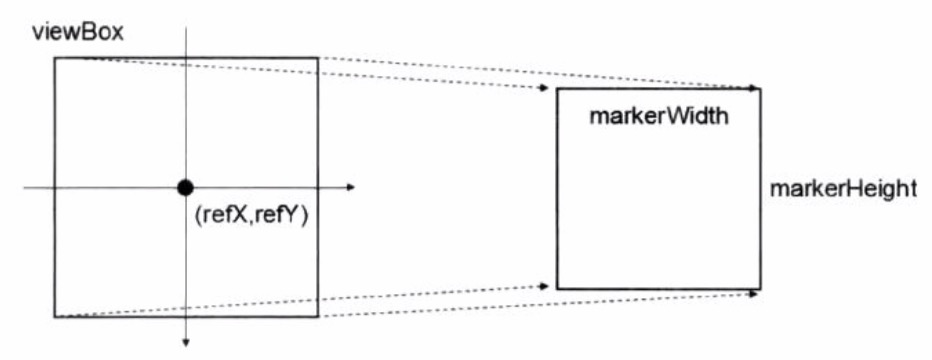
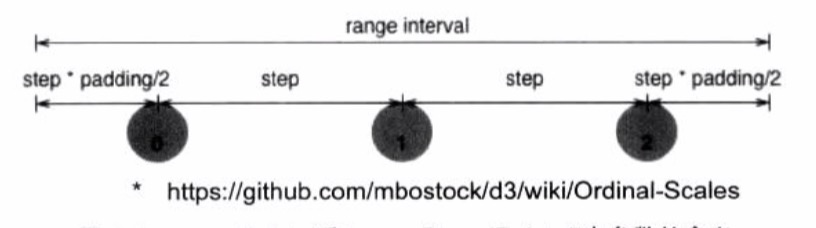
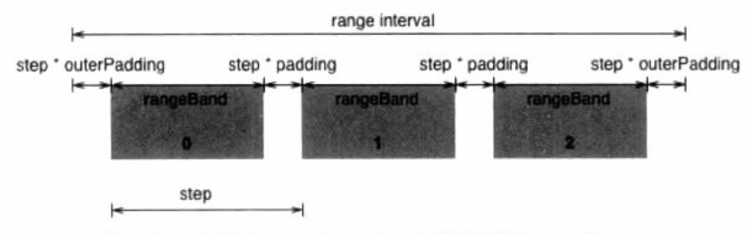
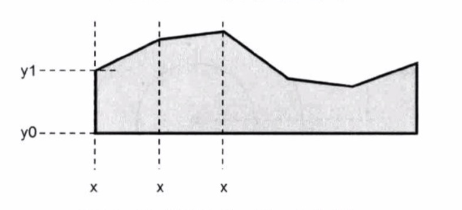
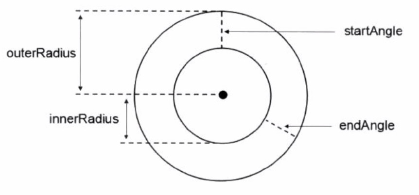

## D3


### 一、SVG基础

##### svg预定于了7种形状元素，分别是

| 图形          | 标签               | 参数                                                         |
| ------------- | ------------------ | ------------------------------------------------------------ |
| 矩形          | rect               | **x**: 左上角x坐标<br />**y**: 作案上交y坐标<br />**width**：矩形的宽度<br />**height**： 矩形的高度<br />**rx**： 对于圆角矩形，指定椭圆在x方向的半径<br />**ry**： 对于圆角矩形，指定椭圆在y方向的半径 |
| 圆形          | circle             | **cx**：圆心的x坐标<br />**cy**：圆心的y坐标<br />**r**：圆的半径 |
| 椭圆          | ellipse            | **cx**：圆心的x坐标<br />**cy**：圆心的y坐标<br />**rx**：椭圆的水平半径<br />**ry**：椭圆的垂直半径 |
| 线段          | line               | **x1**: 起点的x坐标<br />**y1**: 起点的y坐标<br />**x2**: 终点的x坐标<br />**y2**: 终点的y坐标 |
| 多边形 / 折线 | polygon / polyline | **position**：一系列的点坐标                                 |
| 路径          | path               | **d**： 添加路径，如下<br /><br />**移动类**<br />    **M** = moveto: 将画笔移动到指定坐标<br />**直线类**<br />    **L** = lineto：画直线到指定坐标<br />    **H** = horizontal lineto：画水平直线到指定坐标<br />    **V** = vertical lineto：画垂直直线到指定坐标<br />**曲线类**<br />    **C** = curveto：画三次贝塞尔曲线 经 两个指定控制点到达终点坐标<br />    **S** = shorthand / smooth curveto：与前一条三次贝塞尔曲线相连，第一个控制点为前一条曲线第二个控制点的对称点，只需要输入第二个控制点和终点，即可以绘制一个三次贝塞尔曲线<br />    **Q** = quadiratic Bezier curveto：画二次贝塞尔曲线 经一个指定控制点到终点坐标<br />    **T** = shorthand / smooth quadratic Bezier curveto：与前一条二次贝塞尔曲线相连，控制点为前一条二次贝塞尔曲线控制点的对称点，只需要输入终点，即可绘制一个二次贝塞尔曲线<br />**弧线类**<br />    **A** = elliptical arc：画椭圆曲线到指定坐标<br />        **rx**： 椭圆x方向的半轴大小<br />        **ry**： 椭圆y方向的半轴大小<br />        **x-axis-rotation**：椭圆的x轴与水平轴顺时针方向的夹角<br />        **large-arc-flag**：有两个值（1：大角度弧线、0：小角度弧线）<br />        **sweep-flag**：有两个值（1：顺时针到终0：逆时针到终点）<br />        **x**：终点x坐标<br />        **y**：终点y坐标<br />**闭合类**<br />    **Z** = closepath: 绘制一条直线连接终点和起点，用来封闭图形<br /><br />**PS**（上述命令用大写英文字母表示坐标中的绝对坐标，用小写英文字母则表示相对 *当前画笔* 坐标） |
| 文字          | text               | **x**：文字位置的x坐标<br />**y**：文字位置的y坐标<br />**dx**：相对于当前位置在x方向上的平移的距离（正右负左）<br />**dy**：相对于当前位置在y方向上的平移的距离（正下负上）<br />**textLength**：文字的显示长度（不足则拉长，足则压缩）<br />**rotate**：旋转角度（正顺时针， 负逆时针） |


##### 样式

样式可以使用以下属性，也可以指定css 或者 style

| 参数             | 说明                                          |
| ---------------- | --------------------------------------------- |
| fill             | 填充色，改变文字的text的颜色也用这个          |
| stroke           | 轮廓线的颜色                                  |
| stroke-width     | 轮廓线的宽度                                  |
| stroke-linecap   | 轮廓线头断电的样式，圆角、直角等              |
| stroke-dasharray | 虚线的样式                                    |
| opacity          | 透明度0-1                                     |
| font-family      | 字体                                          |
| font-size        | 字体大小                                      |
| font-width       | 字体粗细，有normal，bold，bolder，lighter可选 |
| font-style       | 字体的样式，斜体等                            |
| text-decoration  | 上划线，下划线等                              |

```html
<svg width=500 height=500 version=1.1 xmlns="http://www.w3.org/2000/svg">
  <path d="M30, 100 L270, 300 M30, 100 H270 M30, 100 V300"
        style="stroke:black;stroke-width:3"></path>
</svg>
<svg>
  <path d="M30, 100 C100, 320 190, 20 270, 100"></path>
</svg>
<svg>
  <path d="M100, 200 a200, 150 0 1, 0 150, -150 Z"></path>
</svg>
<svg>
  <text x=200 y=150 dx=-5 dy=5 textLength=90>
    D3 first <tspan fill="red">SVG</tspan> test
  </text>
  <text x=200 y=250 dx=-5 dy=5 textLength=190>
    D3 first <tspan fill="red">SVG</tspan> test
  </text>
</svg>
```


##### 标记

> 标记 marker 是一个重要的概念，能依附于path, line, polyline, polygen元素上，标记marker卸载defs中，defs用于定义可重复使用的图形元素

| 属性                       | 说明                                                         |
| -------------------------- | ------------------------------------------------------------ |
| viewBox                    | 坐标系的区域                                                 |
| refX / refY                | 在viewBox内的基准点， 绘制时此点在直线端点上                 |
| markerUnits                | 标记大小的基准， 有两个值（strokeWidth 线的宽度，userSpaceOnUser 线前端的大小） |
| markerWidth / markerHeight | 标识的大小                                                   |
| orient                     | 绘制方向，可设定为 auto 和 角度值                            |
| id                         | 标识的id号                                                   |



```html
<svg>
  <defs>
    <marker id=arrow
            markerUnits=strokeWidth
            markerWidth=12
            markerHeight=12
            viewBox="0 0 12 12"
            refX=6
            refY=6
            orient=auto
            >
      <path d="M2,2 L10,6 L2,10 L6,6 L2,2" style="fill:black"></path>
    </marker>
  </defs>
  <line x1=0 y1=0 x2=200 y2=50
        stroke=red
        stroke-width=2
        marker-end="url(#arrow)"></line>
  <path d="M20,70 T80,100 T160,80 T200,90"
        fill="white"
        stroke=red
        stroke-width=2
        marker-start="url(#arrow)"
        marker-mid="url(#arrow)"
        marker-end="url(#arrow)"></path>
</svg>
```


##### 滤镜

> 滤镜 filter 和marker一样也是定义于defs。种类很多，都以fe开头，如feMorphology, feGaussianBlur, feFlood

```html
<svg>
  <defs>
    <filter id="GaussianBlur">
      <feGaussianBlur in="SourceGraphic" stdDeviation=2></feGaussianBlur>
    </filter>
  </defs>

  <rect x=100 y=100 width=150 height=100 fill=blue></rect>
  <rect x=300 y=100 width=150 height=100 fill=blue
        filter="url(#GaussianBlur)"></rect>
</svg>
```


##### 渐变

> svg中有linearGradient 线性渐变和 radialGradient 放射性渐变，定义在defs

```html
<svg>
  <defs>
    <linearGradient id="myGradient" x1="0%" y1="0%" x2="100%" y2="0%">
      <stop offset="0%" stop-color="#f00"></stop>
      <stop offset="100%" stop-color="#0ff"></stop>
    </linearGradient>

    <linearGradient id="myGradient2" x1="0%" y1="0%" x2="0%" y2="100%">
      <stop offset="0%" stop-color="#f00"></stop>
      <stop offset="100%" stop-color="#0ff"></stop>
    </linearGradient>

    <linearGradient id="myGradient3" x1="0%" y1="0%" x2="100%" y2="100%">
      <stop offset="0%" stop-color="#f00"></stop>
      <stop offset="100%" stop-color="#0ff"></stop>
    </linearGradient>
  </defs>

  <rect x=100 y=100 width=150 height=100 fill="url(#myGradient)"></rect>
  <rect x=250 y=100 width=150 height=100 fill="url(#myGradient2)"></rect>
  <rect x=100 y=200 width=150 height=100 fill="url(#myGradient3)"></rect>
</svg>
```


### 二、选择集与数据

##### 选择元素

选择器是css选择器或者DOM API所选择的元素

* **select**：匹配选择器的第一个元素
* **selectAll**：匹配选择器的所有元素


##### 选择集

上述返回为选择集（selection），其操作如下

* selection.**empty**()：判断选择集是否为空
* selection.**node**()：返回第一个非空元素，空返回null
* selection.**size**()：返回选择集中的元素个数
* selection.**attr**(name [, value])：设置 或 获取 属性
* selection.**property**(name [, value])：设置 或 获取 属性（attr不生效的， 如文本框的value，复选框的value）
* selection.**classed**(name [, value])：设置 或 获取 选择集的CSS类（value是布尔）
* selection.**style**(name [, value [, priority]])：设置 或 获取 选择集的样式
* selection.**text**([value])：设置 或 获取 选择集的文本内容，不包括内部标签，等同innerText
* selection.**html**([value])：设置 或 获取 选择集的内部html内容，相当于innerHTML

```html
<p>Paragraph 1</p>
<p>Paragraph 2</p>
<p>Paragraph 3</p>
<script>
	var paragraphs = d3.selectAll('p')
  console.log(paragraphs.empty()) // false
  console.log(paragraphs.node()) // <p>Paragraph 1</p>
  console.log(paragraphs.size()) // 3
  
  // classed
  d3.select('p')
    .classed('red', true)
    .classed({red: true, bigSize: true})
    .classed('red bigSize', true)
</script>
```


##### 选择集数据

可添加，插入，删除元素

* selection.**append**(name)：在选择集的末尾添加一个元素，name为元素名称
* selection.**insert**(name [, before])：在选择集中置顶元素前插入一个元素，before是选择器
* selection.**remove**()：删除选择集中的元素


##### 数据绑定

将数据绑定到DOM上

* selection.**datum**([value])：选择集中的每一个元素都绑定相同的数据value
* selection.**data**([values [, key]])：选择集中的每一个元素分别绑定数组values的每一项。key是一个键函数，用于指定绑定数组时的对应规则
  * update：数组长度 = 元素数量
  * enter：数组长度 > 元素数量
  * exit：数组长度 < 元素数量

```javascript
var dataset = [3, 6, 9, 12, 15]
var p = d3.selelct('body').selectAll('p')
var update = p.data(dataset)

console.log(update)
console.log(update.enter())
console.log(update.exit())

// data key调整绑定顺序
var persons = [
  {id: 6, name: 'a'},
  {id: 9, name: 'b'},
  {id: 3, name: 'c'}
]
p.data(persons, function (d) {
  return d.id
}).text(function (d) {
  return d.id + ' : ' + d.name
})

// 输出
// <p> 3: c </p>
// <p> 6: a </p>
// <p> 9: b </p>
```


##### 选择集的处理

* **update**部分直接使用
* **enter**部分可以 selection.enter().append() 的形式添加足够的元素
* **exit**部分是删除 selection.exit().remove()


##### 选择集的处理 二

* **filter **过滤器

  ```javascript
  selection.filer(function (d, i) {
  	return d > 20
  })
  ```

* **sort** 改变顺序

  ```js
  selection.sort(function (a, b) {
    return b - a // 递减排序
  })
  ```

* **each** 对各元素分别处理

  ```js
  var persons = [
    {id: 1, name: 'zhang san'},
    {id: 2, name: 'li si'}
  ]
  
  var p = d3.select('body').selectAll('p')
  p.data(persons).each(function (d, i) {
    d.age = 20
  }).text(function (d, i) {
    return d.id + ' ' + d.name + ' ' + d.age
  })
  ```

* **call** 允许将选择集自身作为参数， 传递给某一个函数

  ```js
  function myfun (selection) {
    selection.attr('name', 'value')
  }
  
  d3.selectAll('div').call(myfun)
  // 等同
  myfun(d3.selectAll('div'))
  ```


##### 数组的处理

* **排序**

  * d3.**ascending**(a, b)： 升序， sort的默认函数

    ```js
    var numbers = [54, 23, 12, 19, 76]
    numbers.sort(d3.ascending)
    console.log(numbers) // [12, 19, 23, 54, 76]
    ```

  * d3.**descending**(a, b)：降序

* **求值**

  * d3.**min**(array [, accessor])：返回最小值 accessor 是在求值前数据处理函数

  * d3.**max**(array [, accessor])：返回最大值

  * d3.**extend**(array [, accessor])：返回最小和最大值的数组

  * d3.**sum**(array [, accessor])：返回数组的总和，数组为空，返回0

  * d3.**mean**(array [, accessor])：返回数组的平均值，数组为空，返回undefined，长度是有效长度（去除undefined等的数组长度）

  * d3.**median**(array [, accessor])：返回数组的中间值，数组为空，返回undefined

  * d3.**quantile**(numbers, p)：返回p分位点的值，p的范围为[0, 1]。数组需先递增排序

    ```js
    // quantile的应用
    var numbers = [3, 1, 10]
    numbers.sort(d3.ascending)
    d3.quantile(numbers, 0) // 1
    d3.quantile(numbers, 0.25) // 2
    d3.quantile(numbers, 0.5) // 3
    d3.quantile(numbers, 0.75) // 6.5
    d3.quantile(numbers, 0.9) // 8.59999999
    d3.quantile(numbers, 1.0) // 10
    
    // median是将数组中的无效值去掉后（undefined，NaN）去掉之后，在找到quantile中0.5分位的值
    var numbers1 = [3, 1, 7, undefined, 9, NaN]
    d3.median(numbers1) // 5
    var numbers2 = [3, 1, 7, undefined, 9, 10, NaN]
    d3.median(numbers2) // 7
    ```

  * d3.**variance**(array [, accessor])：求方差

  * d3.**deviation**(array [, accessor])：求标准差

  * d3.**bisectLeft**(array, findValue)：获取某 数组项 左边的位置

  * d3.**bisect**(array, findValue)：获取某 数组项 右边的位置

  * d3.**bisectRight**(array, findValue)：获取某 数组项 右边的位置，和bisect一致。上述三个主要配合splice使用

* **操作**

  * d3.**shuffle**(array [, lo [,hi]])：随机排列数组

  * d3.**merge**(arrays)：合并两个数组

    ```js
    d3.merge([[1], [2, 3]]) // [1, 2, 3]
    ```

  * d3.**pairs**(array)：返回邻接的数组对（原数组不变）

    ```js
    var colors = ['red', 'blue', 'green']
    var pairs = d3.pairs(colors)
    
    console.log(pairs) // [['red', 'blue'], ['blue', 'green']]
    ```

  * d3.**range**([start, ] stop [, step])：返回等差数列

    ```js
    // start为0， stop为10， step为1
    var a = d3.range(10)
    // 输出 [0, 1, 2, 3, 4, 5, 6, 7, 8, 9]
    console.log(a)
    
    // start为2， stop为10， step为1
    var b = d3.range(2, 10)
    // 输出 [2, 3, 4, 5, 6, 7, 8, 9]
    console.log(b)
    
    // start为2， stop为10， step为2
    var c = d3.range(2, 10, 2)
    // 输出 [2, 4, 6, 8]
    console.log(c)
    ```

  * d3.**permute**(array, indexes)：根据指定的索引号数组返回排列后的数组（原数组不变）

    ```js
    var animals = ['cat', 'dog', 'bird']
    var newAnimals = d3.permute(animals, [2, 1, 0])
    // 输出['bird', 'dog', 'cat']
    console.log(newAnimals)
    ```

  * ```js
    var zip = d3.zip([1000, 1001, 1002], ['zhangsan', 'lisi', 'wangwu'], [true, false, true])
    // 输出为 [[1000, 'zhangsan', true], [1001, 'lisi', false], [1002, 'wangwu', true]]
    
    // 求内积
    var a = [10, 20, 5]
    var b = [-5, 10, 3]
    var ab = d3.sum(d3.zip(a, b), function (d) {
      return d[0] * d[1]
    })
    console.log(ab) // 165
    ```

  * d3.**transpose**(matrix)：求转置矩阵

    ```js
    var a = [ [1, 2, 3], [4, 5, 6] ]
    var t = d3.transpose(a)
    // 输出 [[1, 4], [2, 5], [3, 6]]
    console.log(t)
    ```

* **映射 Map**

  d3.**map**([object] [, key]) 能够构建映射，包括以下方法

  * map.has(key)：判断key存在，返回boolean

  * map.get(key)：取key的值，无则返回undefined

  * map.set(key, value)：设定key的值

  * map.remove(key)：删除key和值，返回true。不存在返回false

  * map.keys()：以数组形式返回该map所有的key

  * map.values()：以数组形式返回该map所有的value

  * map.entries()：以数组形式返回该map所有的key和value

  * map.forEach(function)：同数组

  * map.empty()：判断该映射为空

  * map.size()：返回映射大小

    ```js
    var dataset = [
    	{id: 1001, color: 'red'},
      {id: 1002, color: 'blue'},
      {id: 1003, color: 'green'},
    ]
    
    // 以id作为key
    var map = d3.map(dataset, function (d) {return d.id})
    map.get(1001) / /{id: 1001, color: 'red'}
    ```

* **集合 Set**

  d3.**set**([array])，相关方法如下

  * set.has(value)：判断value是否存在于set中
  * set.add(value)：添加value，返回value。如果有，则不添加
  * set.remove(value)：删除值，返回true。不存在返回false
  * set.values()：以数组形式返回该集合中所有的元素
  * set.forEach(function)：对每一个元素都调用function函数，函数里传入一个参数，即该元素的值
  * set.empty()：判断该集合是否为空
  * set.size()：返回集合大小

* **嵌套结构 Nest**

  d3.**nest**() 嵌套结构能使用键**key**对数组中大量对象进行分类，多个键一层套一层

  * nest.key(function)：指定嵌套结构的键

  * nest.entries(array)：指定数组array将被用于构建嵌套结构

    ```js
    var persons = [
      {id: 100, name: 'zhang 1', year: 1989, hometown: 'beijing'},
      {id: 101, name: 'zhang 2', year: 1987, hometown: 'beijing'},
      {id: 102, name: 'zhang 3', year: 1982, hometown: 'shanghai'},
      {id: 103, name: 'zhang 4', year: 1981, hometown: 'xian'},
      {id: 104, name: 'zhang 5', year: 1989, hometown: 'guangzhou'},
      {id: 105, name: 'zhang 6', year: 1989, hometown: 'beijing'}
    ]
    
    var nest = d3.nest()
    	// year作为第一个键
    	.key(function (d) {return d.year})
    	// hometown作为第二个键
    	.key(function (d) {return d.hometown})
      // 指定将应用嵌套结构的数组为persons
    	.entries(persons)
    ```

    

  * nest.sortKeys(comparator)：按照键对嵌套结构进行排序，接在nest.key()后使用

    ```js
    d3.nest()
    	.key(function (d) {return d.year})
    	.sortKeys(d3.descending)
    	.key() // 其他键的定义
    ```

  * nest.sortValues(comparator)：按照值对应嵌套结构排序

  * nest.rollup(function)：对每一组叶子节点调用指定的函数function，该函数含有一个参数values，是当前叶子节点的数组

  * nest.map(array [, mapType])：以映射的形式输出数组，最外层是一个对象

    ```js
    var person = [
    	{sex: '男', values: 3},
      {sex: '男', values: 7},
      {sex: '男', values: 10},
      {sex: '女', values: 2},
    ]
    
    var nest = d3.nest()
    	.key(function (d) {return d.sex})
    	.map(person, d3.map)
    
    // 输出
    {
      '女': [
        {sex: '女'， values: 2}
      ],
      '男': [
        {sex: '男', values: 3},
      	{sex: '男', values: 7},
      	{sex: '男', values: 10}
      ]
    }
    ```


### 三、比例尺和坐标轴

##### 定量比例尺

> 定义域连续的情况为定量比例尺

* **线性比例尺 d3.scale.linear()**

  * **linear**(x)：输入一个在定义域内的值x， 返回值域内对应的值

  * linear.**invert**(y)：输入一个在值域内的值，返回定义域内对应的值

  * linear.**domain**([numbers])：设定或获取定义域

  * linear.**range**([values])：设定或获取值域（**domain和range最少放入两个数，可以超过，但个数需相等**）

  * linear.**rangeRound**([values])：代替range()使用的话，比例尺的输出值会进行四舍五入的运算，结果为整数

  * linear.**clamp**([boolean])：默认设置为false，当该比例尺接受一个超出定义域范围内的值时，依然能够按照同样的计算方法计算得到一个值，这个值可能是超出值域范围的。如果设置为true，则任何超出值域范围的值，都会被收缩到值域范围内

  * linear.**nice**([count])：将定义域的范围扩展成比较理想的形式。例如，定义域为[0.500000543,  0.8999128199]这样的定义域，则自动将其变为[0, 0.9],定义域为[0.500000543,  69.999128199]这样的定义域，则自动将其变为[0, 70]

  * linear.**ticks**([count])：设定或获取定义域内具有代表性的值的数目。count默认为10，如果定义域为[0, 70]，则该函数返回[0, 10, 20, 30, 40, 50, 60, 70]。如果count设置成3，则返回[0, 20, 40, 60]，该方法主要用于选取坐标轴刻度。

  * linear.**tickFormat**(count [, format])：用于设置定义域内具有代表性的值的表现形式，如显示到小数点后两位，使用百分比的形式显示，主要用于坐标轴上。

    ```js
    var linear = d3.scale.linear()
    	.domain([0, 20]) // 定义域
    	.range([0, 100]) // 值域
    
    console.log(linear(10)) // 50
    console.log(linear(30)) // 150
    console.log(linear.invert(80)) // 16
    
    // 不超过范围
    linear.clamp(true)
    console.log(linear(30)) // 100
    
    
    // 输出整数数值
    linear.rangeRound([0, 100])
    console.log(linear(13.33)) // 67
    
    // ticks
    var linear = d3.scale.linear()
    	.domain([-20, 20])
    	.range([0, 100])
    
    var ticks = linear.ticks(5)
    console.log(ticks) // [-20, -10, 0, 10, 20]
    var tickFormat = linear.tickFormat(5, '+') // 常用格式还有 % $ 等
    for (var i = 0; i < ticks.length; i++) {
      ticks[i] = tickFormat(ticks[i])
    }
    console.log(ticks) // ['-20', '-10', '+0', '+10', '+20']
    
    ```

* **指数和对数比例尺 d3.scale.pow()**

  * 指数中 domain, range, rangeRound, clamp, nice, ticks, tickFormat和线性一致

  * pow.**exponent**(number)：指数比例尺， 用于指定指数

  * pow.**base**()：对数比例尺，用于指定底数

    ```js
    // 设定指数比例尺的指数为3
    var pow = d3.scale.pow().exponent(3)
    console.log(pow(2)) // 8
    console.log(pow(3)) // 27
    
    // 设定指数比例尺的指数为0.5
    pow.exponent(0.5)
    console.log(pow(2)) // 1.414
    console.log(pow(3)) // 1.732
    ```

* **量子比例尺 d3.scale.quantize()**

  > 其定义域是连续的，值域是离散的。值域平分定义域

  ```js
  var quantize = d3.scale.quantize()
  	.domain([0, 10])
  	.range(['red', 'green', 'blue', 'yellow', 'black'])
  
  // [0, 2)对应red， [2, 4)对应green，以此类推
  console.log(quantize(1)) // red
  console.log(quantize(3)) // green
  console.log(quantize(5.999)) // blue
  console.log(quantize(6)) // yellow
  ```

* **分位比例尺 d3.scale.quantile()**

  量子比例尺的分段值只与定义域的起始值和结束值有关，其中间有多少其他数值都没有影响。

  分位比例尺的分段值与定义域中存在的数值都有关。

  ```js
  // 只有两个值，从定义域的2和4的平均数3分开，[0, 3)是1， [3, 10)是100
  var quantile = d3.scale.quantile()
  	.domain([0, 2, 4, 10])
  	.range([1, 100])
  
  // 对比quantize
  var quantize = d3.scale.quantize()
  	.domain([0, 2, 4, 10])
  	.range([1, 100])
  
  console.log(quantize(3)) // 1
  console.log(quantile(3)) // 100
  ```

  * quantile.**quantiles**()：查询分位比例尺的分段值

* **阈值比例尺 d3.scale.threshold()**

  阈值又叫临界值，是指一个效应能够产生的最低值或最高值。

  以下代码定义了三个阈值，将空间分位四段：负无穷到10，10到20，20到30，30到正无穷

  ```js
  var threshold = d3.scale.threshold()
  	.domain([10, 20, 30])
  	.range(['red', 'green', 'blue', 'black'])
  
  console.log(threshold(5)) // red
  console.log(threshold(15)) // green
  console.log(threshold(25)) // blue
  console.log(threshold(35)) // black
  ```

  * threshold.**invertEvent**(value)：通过值域获取定义域


##### 序数比例尺

> 序数比例尺的定义域和值域都是离散的

* d3.scale.**ordinal**()：构建一个序数比例尺

* **ordinal**(x)：输入定义域内一个离散值，返回值域内一个离散值

* ordinal.**domain**([values])：设定或获取定义域

* ordinal.**range**([values])：设定或获取值域

* ordinal.**rangePoints**(interval [, padding])：代替range()设定值域，接受一个连续的区间，然后根据定义域中离散值的数量将其分段，分段值即作为值域的离散值**（interval是区间， padding是边界部分留下的空白，值指的是几倍的step宽度）**

* ordinal.**rangeRoundPoints**(interval [, padding])：和rangePoints()一样，但是会将结果取整

* ordinal.**rangeBands**(interval [, padding [, outerPadding]])：代替range()设定值域，与rangePoints()一样，也是接受一个连续的区间，然后根据定义域中离散值的数量将其分段，但是其分段方法是不同的。**（interval是区间， padding是内部的空白，outerPadding是外部的空白）**

* ordinal.**rangeRoundBands**(interval [, padding [, outerPadding]])：和rangeBands()，但是会将结果取整。

* ordinal.**rangeBand**()：返回使用rangeBand()设定后每一段的宽度

* ordinal.**rangeExtend**()：返回一个数组，数组里存有值域的最大值和最小值

  

  ```js
  var ordinal = d3.scale.ordinal()
  	.domain([1, 2, 3, 4, 5])
  	.range([10, 20, 30, 40, 50])
  
  console.log(ordinal(1)) // 10
  console.log(ordinal(3)) // 30
  console.log(ordinal(5)) // 50
  console.log(ordinal(8)) // 10 输入值不在定义域中
  
  //
  var ordinal = d3.scale.ordinal()
  	.domain([1, 2, 3, 4, 5])
  	.rangePoints([0, 100])
  
  console.log(ordinal.range()) // [0, 25, 50, 75, 100]
  console.log(ordinal(1)) // 0
  console.log(ordinal(3)) // 50
  console.log(ordinal(5)) // 100
  
  // padding的5是指5倍step的距离，平分在两侧
  ordinal.rangePoints([0, 100], 5) // padding为5则一共有9个step
  console.log(ordinal.range()) // [27.77777, 38.88888, 50, 61.11111, 72.22222]
  
  // rangeRoundPoints则取整
  ordinal.rangeRoundPoints([0, 100], 5)
  console.log(ordinal.range()) // [28, 39, 50, 61, 72]
  ```

  	

  ```js
  // padding和outerPadding默认为0，计算可得，rangeBand为20， 值域有五个离散的值，分别是没一个rangeBand区域的起点
  var bands = d3.scale.ordinal()
  	.domain([1, 2, 3, 4, 5])
  	.rangeBands([0, 100])
  
  console.log(bands.range()) // [0, 20, 40, 60, 80]
  console.log(bands.rangeBand()) // 20
  ```

* 四种颜色的序数比例尺

  * d3.scale.**category10**()：10种颜色
  * d3.scale.**category20**()：20种颜色
  * d3.scale.**category20b**()：20种颜色
  * d3.scale.**category20c**()：20种颜色


##### 坐标轴 Axis

* d3.svg.**axis**()：创建一个默认的新坐标轴 (v5 d3.axisBottom())
* **axis**(selection)：将此坐标轴应用到指定的选择集上，该选择集需要包含有**svg或g**元素
* axis.**scale**([scale])：设定或获取坐标轴的比例尺
* axis.**orient**([orientation])：设定或获取坐标轴的方向，有四个值，top,bottom,left,right。top表示水平坐标轴的刻度在直线下方
* axis.**ticks**([argument...])：设定或者获取坐标轴的分隔数，默认为10
* axis.**tickValues**([values])：设定或获取坐标轴的指定刻度
* axis.**tickSize**([inner, outer])：设定或获取坐标轴的内外刻度的长度，默认都是6(v5 只设置一个)
* axis.**innerTickSize**([size])：设定或获取坐标轴的内刻度的长度，内刻度指不是两端的刻度
* axis.**outerTickSize**([size])：设定或获取坐标轴的外刻度的长度，外刻度指两端的刻度
* axis.**tickFormat**([format])：设定或获取刻度的格式


### 四、绘制

> d3本身没有作图的功能，只能为我们计算出作图所需的数据，而svg则是最适合d3的作图工具

##### 颜色

* **RGB**

  * d3.**rgb**(r, g, b)：以3个色值创建

  * d3.**rgb**(color)：以字符串创建（如 rgb(255, 255, 255), hsl(120, 0.5, 0.5), #fffeee, red 等）

  * rgb.**brighter**([k])：颜色变得更明亮，值 * 0.7 ^ -k

  * rgb.**darker**([k])：颜色变得更暗，值 * 0.7 ^ k，上述两个返回新的颜色对象，不会改变原来的对象

  * rgb.**hsl**()：返回颜色对应的hsl值

  * rgb.**toString**()：以字符串形式返回该颜色值

    ```js
    var color1 = d3.rgb(40, 80, 0)
    var color2 = d3.rgb('red')
    var color3 = d3.rgb('rgb(0, 255, 255)')
    
    console.log(color1.brighter(2)) // 81,163,0
    console.log(color2.darker(2)) // 124,0,0
    console.log(color3.hsl()) // 180,1,0.5
    ```

* **HSL**

  方法同rgb，只是颜色通道的意义不一样，h代表色相（0-360，0红，120绿，240蓝色），饱和度0-1，明度0-1

* **插值**

  d3.interpolate(rgb, rgb)：返回一个对应的函数，来计算介于两个颜色之间的颜色，如rgb,hsl都行


##### 线段生成器 line

* d3.svg.**line**()：创建线段生成器
* **line**(data)：使用线段生成器绘制data数据
* line.**x**([x])：设置或获取线段x坐标的访问器，即使用什么数据作为线段的x坐标
* line.**y**([x])：设置或获取线段y坐标的访问器
* line.**interpolate**([interpolate])：设置或获取线段的插值模式，共13种(v5 curve)
* line.**tension**([tension])：设置或获取张力系数，当插值模式为cardinal，cardinal-open，cardinal-closed的时候有效
* line.**defined**([defined])：设置或获取一个访问器，用于确认线段是否存在，只有判断为存在的数据才会被绘制


##### 区域生成器 area

与线段生成器类似，访问器有x,x0,x1,y,y0,y1六个



##### 弧生成器 arc

* **innerRadius**()
* **outerRadius**()：外半径
* **statrAngle**()
* **endAngle**()：单位是弧度，190度用3.1415926（Math.PI）
* arc.**centroid**(d)：弧的中心位置，返回的是二维坐标




##### 符号生成器 symbol

* d3.svg.**symbol**()：创建一个符号生成器
* **symbol**(datum [, index])：返回指定数据 datum 的路径字符串
* symbol.**type**([type])：设定或获取符号的类型（v5）
  * [d3.symbols](https://github.com/d3/d3-shape#symbols) - 符号类型数组。
  * [d3.symbolCircle](https://github.com/d3/d3-shape#symbolCircle) - 圆形。
  * [d3.symbolCross](https://github.com/d3/d3-shape#symbolCross) - 十字。
  * [d3.symbolDiamond](https://github.com/d3/d3-shape#symbolDiamond) - 菱形。
  * [d3.symbolSquare](https://github.com/d3/d3-shape#symbolSquare) - 方形。
  * [d3.symbolStar](https://github.com/d3/d3-shape#symbolStar) - 五角星。
  * [d3.symbolTriangle](https://github.com/d3/d3-shape#symbolTriangle) - 上三角。
  * [d3.symbolWye](https://github.com/d3/d3-shape#symbolWye) - Y形。
* symbol.**size**([size])：设定或获取符号的大小，单位是像素的平方，默认64


##### 弦生成器 chord (v5 不存在)

* d3.svg.**chord**()：生成弦生成器
* chord.**source**()：起始弧
* chord.**target**()：终止弧
* chord.**radius**()：半径
* chord.**startAngle**()：起始角度
* chord.**endAngle**()：终止角度


### 五、动画

##### 过渡

过渡效果的起始状态和目标状态都很明确，指定之后元素会从起始状态缓缓变为目标状态，时间是确定的。

* d3.**transition**([selection] , [name])：创建一个过渡对象，参数是选择集。由于每个选择集中都有transition方法，可用d3.select('rect').transition()的方式来创建过渡，一般不直接使用此方法。

* transition.**delay**([delay])：设定延迟的时间

* transition.**duration**([duration])：设定过渡的持续时间（不包含延迟的时间）

* transition.**ease**(value [, arguments])：设定过渡样式，例如线性过渡、在目标处弹跳几次等方式。

  ```js
  var width = 300
  var height = 300
  var svg = d3.select('body').append('svg').attr('width', width).attr('height', height)
  var rect = svg.append('rect')
    .attr('fill', 'steelblue')
    .attr('x', 10)
    .attr('y', 10)
    .attr('width', 100)
    .attr('height', 30)
    .transition()
    .attr('width', 300)
  
  // 没使用transition之前返回的rect是一个选择集对象
  console.log(rect) // 此时是一个过渡对象
  ```

* transition.**attr**(name, value)：将属性name过渡到目标值value，value可以是一个函数

* transition.**attrTween**(name, tween)：将属性name使用插值函数tween()进行过渡，tween有三个参数d,i,a

  * d：被绑定数据

  * i：索引号

  * a：属性的初始值

    该函数返回的 function (t) {return xxx} 就是插值函数，参数t的范围是[0, 1]

    ```js
    var svg2 = d3.select('body').append('svg').attr('width', width).attr('height', height)
    var rectIns2 = svg2.append('rect')
    .attr('fill', 'steelblue')
    .attr('x', 10)
    .attr('y', 10)
    .attr('width', 100)
    .attr('height', 30)
    rectIns2.transition()
      .duration(2000)
      .attrTween('width', function (d, i, a) {
      return function(t) {
        // d:undefined, i:0, a: [rect]对象
        console.log(a[i].width) //?
        return 100 + t * 300
      }
    })
    ```

* transition.**style**(name, value [, priority])：将css样式的name属性过渡到目标值value。priority是可选参数，表示css样式的优先级，只有null和important两个值。

* transition.**styleTween**(name, tween [, priority])：类似attrTween

* transition.**text**(value)：过渡开始时，把文本设置成value值

* transition.**tween**(name, factory)

* transition.**remove**()：过渡结束后，删除被选择的元素


##### 子元素

在使用selection.transition()的时候，过渡是针对选择集自身的元素来说的，选择集里的子元素不受影响。

* transition.**select**(selector)：选择符合选择器的第一个子元素进行过渡

* transition.**selectAll**(selector)：选择符合选择器的所有子元素进行过渡

* transition.**filter**(selector)：过滤器，选择过渡对象的子元素

* transition.**each**([type, ] listener)：type表示时间的类型，有start，end，interrupt三个值（v5不存在）。当对应事件发生时调用listener。type省略即和选择集的each一致

  interrupt事件在 某过渡进行中，该元素又在别处被调用一个新的过渡，这时候就会发生打断事件

* transition.**call**(function[, arguments...])：以过度对象本身为参数调用function


##### 过渡样式

* **linear**：线性地变化（v5  d3.easeLinear 以下类似）
* **cubic**：默认的方式，逐渐加快速度
* **elastic**：像弹簧一样接近终点
* **back**：先往回缩一点，在冲到终点
* **bounce**：在终点处弹跳几次
* 上述加以下后缀可：
  * **-in**：按正方向运动
  * **-out**：按反向运动(其实是默认的)
  * **-in-out**：前半段按正方向运动，后半段按反方向运动
  * **-out-in**：前半段按反方向运动，后半段按正方向运动


##### 定时器

setTimeout和setInterval也可，或是使用d3.timer使用requestAnimationFrame实现

**d3.timer**(fn, delay, delayStartTime)

```js
// 应用过渡
var center = [
  [0.5, 0.5],
  [0.7, 0.8],
  [0.4, 0.9],
  [0.11, 0.32],
  [0.88, 0.25],
  [0.75, 0.12],
  [0.5, 0.1],
  [0.2, 0.3],
  [0.4, 0.1],
  [0.6, 0.7]
]

var svg = d3.select('body').append('svg').attr('width', 500).attr('height', 500)
// d3.select('body')
//     .append('button')
//     .text('增加')
//     .property('onclick', add)
var padding = 30
var xAxisWidth = 300
var yAxisWidth = 300
var xScale = d3.scaleLinear()
.domain([0, 1])
.range([0, xAxisWidth])
var yScale = d3.scaleLinear()
.domain([0, 1])
.range([0, yAxisWidth])

drawCircle()
drawAxis()
function drawCircle() {
  var circleUpdate = svg.selectAll('circle').data(center)
  var enter = circleUpdate.enter()
  var exit = circleUpdate.exit()

  circleUpdate.transition()
    .duration(500)
    .attr('cx', function (d) {
    return padding + xScale(d[0])
  })
    .attr('cy', function (d) {
    // 500 height
    return 500 - padding - yScale(d[1])
  })

  enter.append('circle')
    .attr('fill', 'black')
    .attr('cx', padding)
    .attr('cy', 500 - padding)
    .attr('r', 7)
    .transition()
    .duration(500)
    .attr('cx', function (d) {
    return padding + xScale(d[0])
  })
    .attr('cy', function (d) {
    return height - padding - yScale(d[1])
  })

  exit.transition()
    .duration(500)
    .attr('fill', 'white')
    .remove()
}

function drawAxis() {
  var xAxis = d3.axisBottom()
  .scale(xScale)
  .ticks(5)
  yScale.range([yAxisWidth, 0])
  var yAxis = d3.axisLeft()
  .scale(yScale)
  .ticks(5)

  svg.append('g')
    .attr('class', 'axis')
    .attr('transform', 'translate(' + padding + ',' + (height - padding) + ')')
    .call(xAxis)
  svg.append('g')
    .attr('class', 'axis')
    .attr('transform', 'translate(' + padding + ',' + (height - padding - yAxisWidth) + ')')
    .call(yAxis)
  yScale.range([0, yAxisWidth])
}

function add () {
  console.log('add')
  center.push([Math.random(), Math.random()])
  drawCircle()
}
```

```js
function getTimeString () {
  var time = new Date()
  var hours = time.getHours()
  var minutes = time.getMinutes()
  var seconds = time.getSeconds()

  hours = hours < 10 ? '0' + hours : hours
  minutes = minutes < 10 ? '0' + minutes : minutes
  seconds = seconds < 10 ? '0' + seconds : seconds
  return  hours + ':' + minutes + ':' + seconds
}

var svg = d3.select('body').append('svg').attr('width', 300).attr('height', 300)
var timeText = svg.append('text')
.attr('x', 100)
.attr('y', 100)
.attr('class', 'time')
.text(getTimeString())

setInterval(updateTime, 1000)
function updateTime () {
  timeText.text(getTimeString())
}
```


### 六、交互

