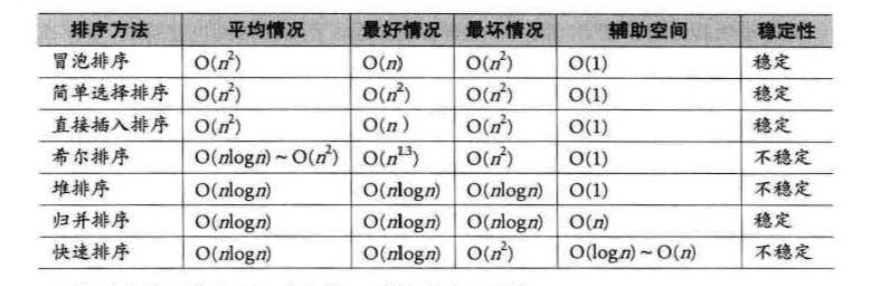

## 排序


#### 一、 基本概念和术语

> **排序**： 将一组对象按照某种逻辑顺序重新排列的过程
>
> **排序的稳定性**：假设 ki=kj (1≦i≦n，1≦j≦n，i≠j)，且在排序前的序列中 ri领先于 rj (即 i<j)。 如果排序后 ri仍领先于rj，则称所用的排序方法是稳定的;反之，若可能使得排序后的序列中 rj 领先 ri，则称所用的排序方法是不稳定的。
>
> **内排序和外排序**: 根据在排序过程中待排序的记录是否全部被放置在内存中,排序分为:内排序和外排序 
>
> **内排序**性能主要受三个方面影响：
>
> * 时间性能：高效率的内排序算法应该是具有尽可能少的关键字比较次数和尽可能少的记录移动次数 
> * 辅助空间
> * 算法复杂度：指的是算法本身的复杂度，而不是指算法的时间复杂度
>
> 根据排序过程中借助的主要操作，我们把内排序分为:**插入排序、交换排序、选择排序和归并排序**。




```javascript
// 排序用到的结构
class Struct () {
  constructor (list) {
    this.tempList[list.length] // 用于储存要排序的数组
    this.temp //用作哨兵或者临时变量
    this.length // 记录顺序表长度
  }
}

function swap (list, pre, next) {
  let temp = list[pre]
  list[pre] = list[next]
  list[next] = temp
}
```


#### 二、 冒泡排序 Bubble Sort

> 一种交换排序，基本思想是，两两比较相邻记录的关键字，如果反序则交换，知道没有反序的记录为止
>
> 时间复杂度O(n²)

```javaScript
// 最简单排序实现
function BubbleSort_0 (list) {
  for (let i = 0; i < list.length; i++) {
    for (let j = i + 1; j < list.length; j++) {
    	if (list[i] > list[j]) {
        swap(list, i, j)
      }
  	}
  }
}

// 冒泡排序
function BubbleSort (list) {
  for (let i = 0; i < list.length; i++) {
    // 从后向前
    for (let j = list.length - 1; j > i ; j--) {
      if (list[j] < list[j-1]) {
        swap(list, j, j-1)
      }
    }
  }
}

// 冒泡排序改进
function BubbleSort_adv (list) {
  let flag = true
  for (let i = 0; i < list.length && flag; i++) {
    flag = false
    
    // 从后向前
    for (let j = list.length - 1; j > i ; j--) {
      if (list[j] < list[j-1]) {
        swap(list, j, j-1)
        flag = true //如果有数据交换，则 flag 为 true
      }
    }
  }
}
```


#### 三、 简单选择排序 Simple Selection Sort

> 通过n-i次关键字的比较，从n-i+1个记录中选出关键字最小的记录，并和第i个（1 ≦ i ≦ n）记录交换
>
> 时间复杂度O(n²)，性能上略优于冒泡排序(移动少)

```javascript
function SelectSort (list) {
  for (let i = 0; i < list.length; i++) {
    let minIdx = i
    for (let j = i+1; j < list.length; j++) {
      if (list[minIdx] > list[j]) {
        minIdx = j
      }
    }
    
    if (i !== minIdx) {
      swap(list, i, minIdx)
    }
  }
}
```


#### 四、 直接插入排序 Straight Insertion Sort

> 将一个记录插入到已经排好序的有序表中，从而得到一个新的，记录数增加1的有序表
>
> 时间复杂度O(n²)，性能上略优于前两者

```javascript
function InsertSort (list) {
  for (let i = 1; i < list.length; i++) {
    if (list[i] < list[i-1]) {
      let temp = list[i]
      let j
      for (j = i-1; list[j] > temp; j--) {
        list[j+1] = list[j] //记录后移
      }
      
      list[j+1] = temp
    }
  }
}
```


#### 五、 希尔排序 Shell  Sort

> 第一个（1959年）突破时间复杂度O(n²)的算法
>
> 把记录按下标的一定增量分组，对每组使用直接插入排序算法排序；随着增量逐渐减少，每组包含的关键词越来越多，当增量减至1时，整个文件恰被分成一组，算法便终止。
>
> 不稳定排序，时间复杂度在O(n㏒n)，最坏复杂度和插入排序一样O(n²)

```javascript
function ShellSort (list) {
	let step = list.length
  do {
    step = Math.floor(step / 3) + 1
    
    for (let i = step; i < list.length; i++) {
      if (list[i] < list[i - step]) {
        let temp = list[i]

        // 此处是插入排序咯， 前面都已经有序
        for (let j = i - step; j >= 0 && temp < list[j]; j -= step) {
          list[j+step] = list[j]
        }
        list[j+step] = temp
      }
    }
  } while (step > 1)
}
```


#### 六、 堆排序 Heap Sort

> **堆**是具有下列性质的**完全二叉树**:每个节点的值都大于或者等于其左右孩子的值，成为大顶堆。或者每个节点的值都小于或等于其左右孩子节点的值，成为小顶堆
>
> **堆排序**：就是利用堆(栗子大顶堆)，将待排序的序列构建成一个大顶堆，此时，最大值就是根，将他移走，然后将剩余的n-1个序列重新构建成一个大顶堆，反复直到获取一个有序序列
>
> 不稳定排序，时间复杂度：构建堆为O(n)，总共是O(n㏒n)

```javascript
function HeapSort (list) {
  // 构建堆
  for (let i = Math.floor(list.length / 2); i >= 0; i--) {
    HeapAdjust (list, i, list.length)
  }
  
  for (let i = list.length - 1; i > 0; i--) {
    swap(list, 0, i)
    HeapAdjust(list, 0, i)
  }
}

// 将最大的元素调整到堆顶
function HeapAdjust (list, pos, len) {
  let temp = list[pos]
  let child = pos * 2 + 1 //定位到当前节点的左边子节点
  
  // 遍历所有子节点
  while (child < len) {
    // 判断当前节点是否存在右节点，若右节点较大
    if (child + 1 < len && list[child] < list[child + 1]) {
      child +=1
    }
    
    // 比较当前节点和最大的子节点， 小于就交换，交换后将当前节点定位到子节点上
    if (list[pos] < list[child]) {
      list[pos] = list[child]
      pos = child
      child = pos * 2 + 1
    } else {
      break
    }
    
    list[pos] = temp
  }
}
```


#### 七、 归并排序 Merging Sort

> **归并排序**：假设初始序列含有n个记录，则可以看成是n个有序的子序列，每个子序列的长度为1，然后两两归并，得到 n/2 个长度为2或1的有序子序列。再两两归并，如此反复，直至得到一个长度为n的有序序列为止。称2路归并排序
>
> 稳定排序，时间复杂度O(n㏒n)

```javascript
function divide (p, r) {
  return Math.floor((p + r) / 2)
}

function merge (list, p, q, r) {
  let list1 = list.slice(p, q)
  let list2 = list.slice(q, r)
  // 哨兵，往A1和A2里push一个最大值，比如防止A1里的数都比较小，导致第三次遍历某个数组里没有值
  list1.push(Number.MAX_SAFE_INTEGER)
  list2.push(Number.MAX_SAFE_INTEGER)
  
  // 循环做比较，每次取出较小的那个值
  for (let i = p, j = 0, k = 0; i < r; i++) {
    if (list1[j] < list2[k]) {
      list[i] = list1[j]
      j++
    } else {
      list[i] = list2[k]
      k++
    }
  }
}

function MergeSort (list, p = 0, r) {
  r = r || list.length
  if (r - p === 1) {
    return
  }
  
  const q = divide(p, r)
  MergeSort(list, p, q)
  MergeSort(list, q, r)
  merge(list, p, q, r)
}
```


#### 八、 快速排序 Quick Sort

> 通过一趟排序将待排记录分割成独立的两部分，其中一部分记录的关键字比另一部分记录的关键字小，则可分别对这两部分记录继续进行排序，以达到整个序列有序的目的。
>
> 不稳定排序，时间复杂度O(n㏒n)

```javascript
function QuickSort (list) {
  if (list.length <= 1) return list
  
	let num = Math.floor(list.length / 2)
  let numVal = list.splice(num, 1)
  
  let left = [], right = []
  for (let i = 0; i < list.length; i++) {
    if (list[i] < numVal) {
      left.push(list[i])
    } else {
      right.push(list[i])
    }
  }
  
  return QuickSort(left).concat(numVal, QuickSort(right))
}

```

