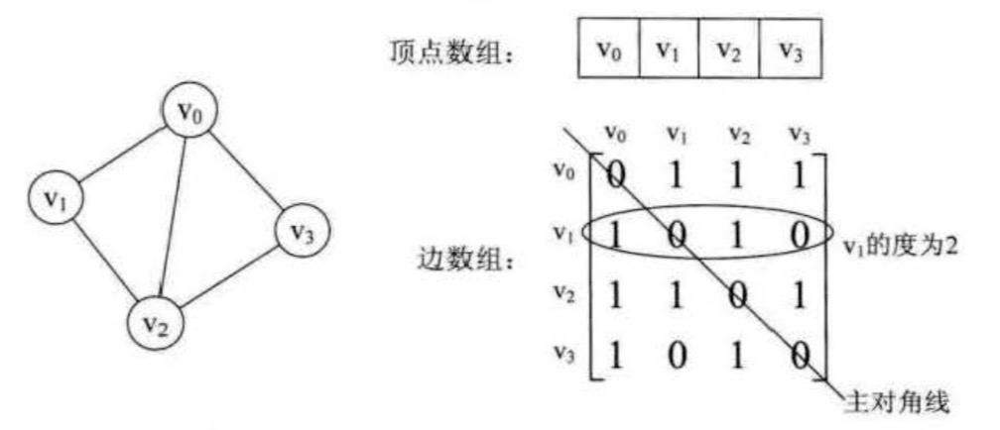
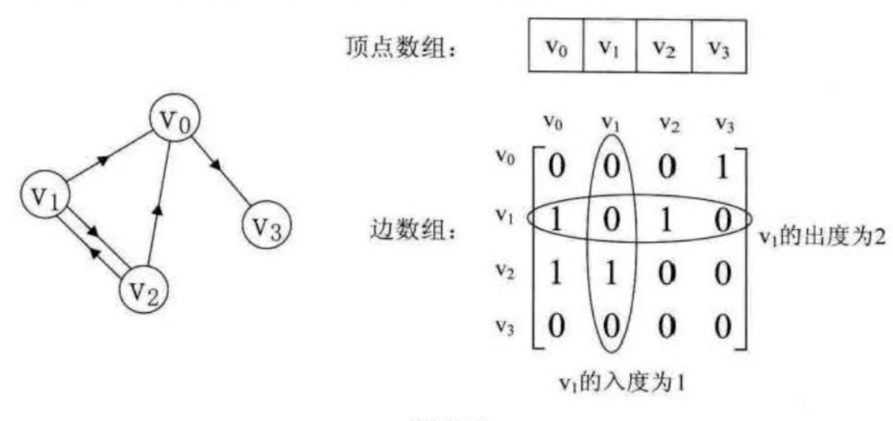
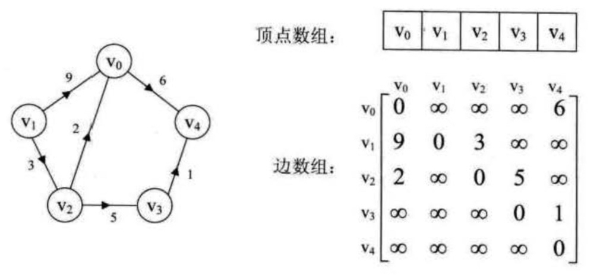

## 图


### 一、术语
* 图( Graph )是由**顶点的有穷非空集合**和**顶点之间边**的集合组成，通常表示为: G (V，E )，其中， G表示一个图， V 是图 G 中顶点的集合， E是图G中边的集合。
* 图分为**无向图**和**有向图**，无向图由顶点和边组成，有向图由顶点和弧构成，有弧头和弧尾之分
* 无向图顶点的边数叫做**度** ，有向图顶点分为**入度**和**出度**。
* 图按照边或弧的多少分稀疏图和稠密图。如果任意两个顶点之间都存在边叫**完全图**， 有向的叫**有向完全图**。若无重复的边或顶点到自身的边则叫**简单图**
* 图上的边或弧上带权则称为**网**
* 图中顶点间存在**路径** ，两顶点存在路径则说明是连通的，如果路径最终回到起始点则称为**环**， 当中不重复叫简单路径。
若任意两顶点都是连通的，则图就是**连通图**， 有向则称**强连通图**。 图中有子图， 若子图极大连通则就是**连通分量**， 有向的则称**强连通分量**
* 无向图中连通旦 n 个顶点 n-l 条边叫**生成树**。有向图中一个顶点入度为0。其余顶点入度为 1 的叫**有向树**。 一个有向固自若干棵有向树构成生成森林


### 二、图的抽象结构 ADT
```
Data
    顶点的有穷非空集合
    边的集合

Operation
    CreateGraph (*G，V，VR) :按照顶点集V和边孤集VR的定义构造图G 
    DestroyGraph (*G) :图G存在别销毁。
    LocateVex (G, u) :若图 G 中存在顶点u，则返回图中的位置。
    GetVex (G, v) :返回图G 中顶点 v 的值。
    PutVez(G,v,value) :将图G中顶点v赋位value
    FirstAdjVex (G，*v) :返回顶点 v 的一个邻接顶点，若顶点在 G 中无邻接顶点返回空
    NextAdjllex (G, v，*w) :返回顶点 v 相对于顶点 w 的下一个邻接顶点，若w 是 v 的最后一个邻接顶点，返回"空" 。 
    InSertVex (*G，v) :在图G中增添新顶点v。
    DeleteVex (*G，v) :删除图G中顶点v及其相关的孤。
    InsertArc (*G，v，w) : 在图 G 中增添弧<v, w>，若G是无向图，还需妥培添对称孤<w, v>
    DeleteArc (*G，v，w) :在图 G 中删除孤<v，w>，若G是无向图，则还删除对称孤<w, v>
    DFSTraverse (G) :对图 G 中进行深度优先造历，在造历过程对每个顶点调用 。
    HFSTraverse (G) :对图 G 中进行广度优先造历.在造历过程对每个顶点调用 。
```


### 三、图的存储结构
五种不同的存储结构
1. 邻接矩阵
> 图的邻接矩阵 (Adjacency Matrix) 存储方式是用两个数组来表示图。一个一维数组存储图中顶点信息 ，一个二维数组〈称为邻接矩阵)存储图中的边或弧的信息




2. 邻接表
> 邻接矩阵在稀疏图上浪费了极大的存储空间，邻接表的处理办法是这样：
> 1. 图中顶点用一个一维数组存储，当然，顶点也可以用单链表来存储，不过数组可以较容易地读取顶点信息，更加方便。
另外，对于顶点数组中，每个数据元素还需要存储指向第一个邻接点的指针，以便于查找该顶点的边信息。
> 2. 图中每个顶点Vi的所有邻接点构成一个线性表，由于邻接点的个数不定，所以用单链表存储，无向图称为顶点Vi的边表，有向图则称为顶点Vi作为弧尾的出边表。


3. 十字链表
> 对于有向图来说，邻接表无法知道入度，逆邻接表不知道出度，将其整合在一起就是十字链表。