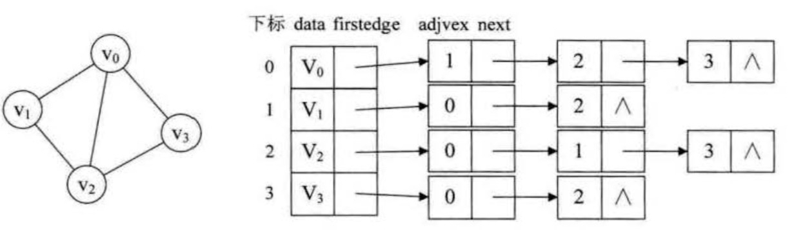
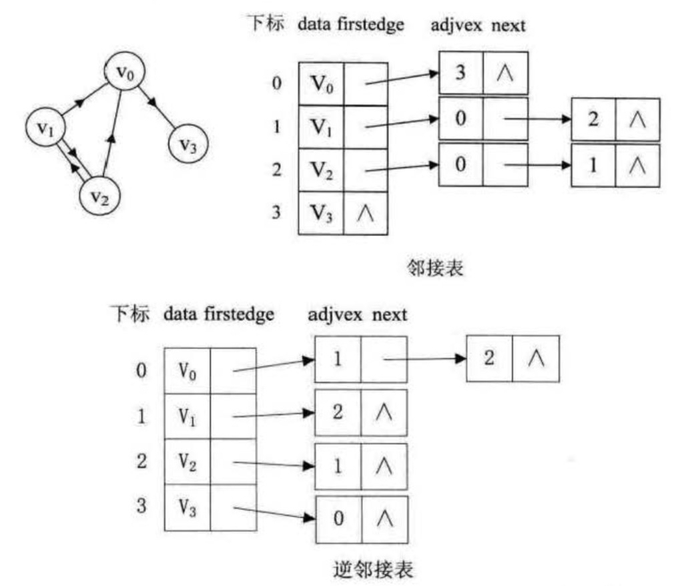
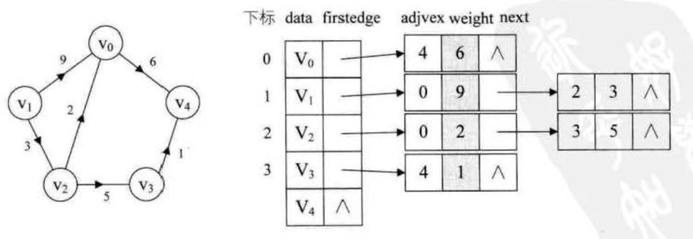
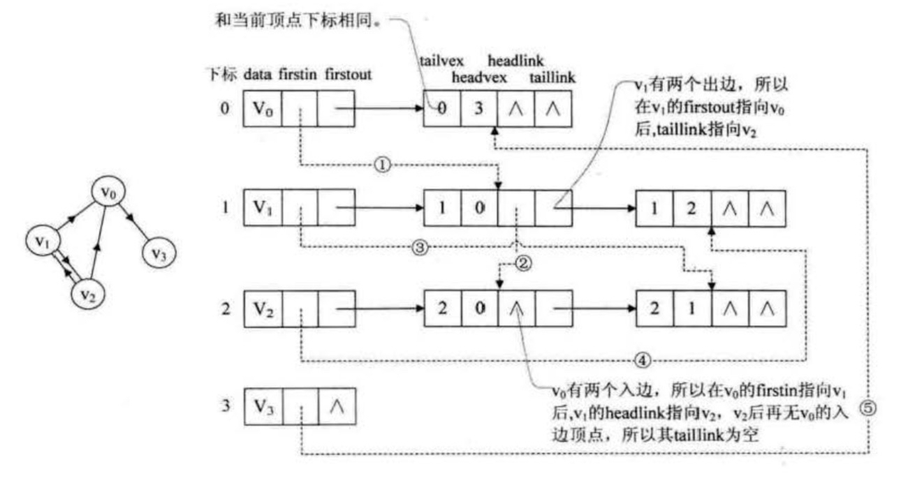
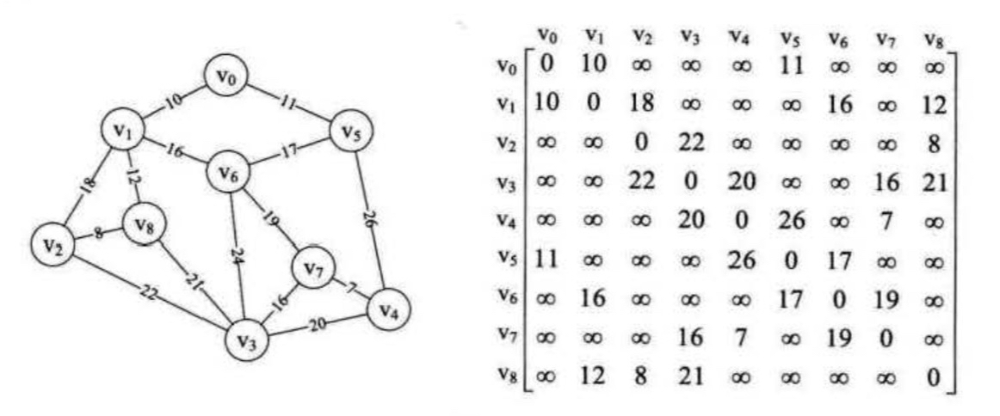

## 图


#### 一. 术语

* 图( Graph )是由**顶点的有穷非空集合**和**顶点之间边**的集合组成，通常表示为: G (V，E )，其中， G表示一个图， V 是图 G 中顶点的集合， E是图G中边的集合。
* 图分为**无向图**和**有向图**，无向图由顶点和边组成，有向图由顶点和弧构成，有弧头和弧尾之分
* 无向图顶点的边数叫做**度** ，有向图顶点分为**入度**和**出度**。
* 图按照边或弧的多少分稀疏图和稠密图。如果任意两个顶点之间都存在边叫**完全图**， 有向的叫**有向完全图**。若无重复的边或顶点到自身的边则叫**简单图**
* 图上的边或弧上带权则称为**网**
* 图中顶点间存在**路径** ，两顶点存在路径则说明是连通的，如果路径最终回到起始点则称为**环**， 当中不重复叫简单路径。
若任意两顶点都是连通的，则图就是**连通图**， 有向则称**强连通图**。 图中有子图， 若子图极大连通则就是**连通分量**， 有向的则称**强连通分量**
* 无向图中连通旦 n 个顶点 n-l 条边叫**生成树**。有向图中一个顶点入度为0。其余顶点入度为 1 的叫**有向树**。 一个有向固自若干棵有向树构成生成森林


#### 二、图的抽象结构 ADT

```
Data
    顶点的有穷非空集合
    边的集合

Operation
    CreateGraph (*G，V，VR) :按照顶点集V和边孤集VR的定义构造图G 
    DestroyGraph (*G) :图G存在别销毁。
    LocateVex (G, u) :若图 G 中存在顶点u，则返回图中的位置。
    GetVex (G, v) :返回图G 中顶点 v 的值。
    PutVez(G,v,value) :将图G中顶点v赋位value
    FirstAdjVex (G，*v) :返回顶点 v 的一个邻接顶点，若顶点在 G 中无邻接顶点返回空
    NextAdjllex (G, v，*w) :返回顶点 v 相对于顶点 w 的下一个邻接顶点，若w 是 v 的最后一个邻接顶点，返回"空" 。 
    InSertVex (*G，v) :在图G中增添新顶点v。
    DeleteVex (*G，v) :删除图G中顶点v及其相关的孤。
    InsertArc (*G，v，w) : 在图 G 中增添弧<v, w>，若G是无向图，还需妥培添对称孤<w, v>
    DeleteArc (*G，v，w) :在图 G 中删除孤<v，w>，若G是无向图，则还删除对称孤<w, v>
    DFSTraverse (G) :对图 G 中进行深度优先造历，在造历过程对每个顶点调用 。
    HFSTraverse (G) :对图 G 中进行广度优先造历.在造历过程对每个顶点调用 。
```


#### 三、图的存储结构

​	五种不同的存储结构

##### 1. 邻接矩阵

> 图的邻接矩阵 (Adjacency Matrix) 存储方式是用两个数组来表示图。一个一维数组存储图中顶点信息 ，一个二维数组〈称为邻接矩阵)存储图中的边或弧的信息  
邻接矩阵-无向图

邻接矩阵-有向图

邻接矩阵-有向网


##### 2. 邻接表

> 邻接矩阵在稀疏图上浪费了极大的存储空间，邻接表的处理办法是这样:
> 1. 图中顶点用一个一维数组存储，当然，顶点也可以用单链表来存储，不过数组可以较容易地读取顶点信息，更加方便。
另外，对于顶点数组中，每个数据元素还需要存储指向第一个邻接点的指针，以便于查找该顶点的边信息。
> 2. 图中每个顶点Vi的所有邻接点构成一个线性表，由于邻接点的个数不定，所以用单链表存储，无向图称为顶点Vi的边表，有向图则称为顶点Vi作为弧尾的出边表 
>
> 邻接表-无向图

邻接表-有向图

邻接表-带权的网


##### 3. 十字链表

> 对于有向图来说，邻接表无法知道入度，逆邻接表不知道出度，将其整合在一起就是十字链表。  

> 顶点表的结构：
> ```
> {data, firstIn, firstOut}
> ```
> firstIn表示入边表头指针，firstOut表示出边表头指针

> 边表节点的结构：
> ```
> {tailVex, headVex, headLink, tailLink}
> ```
> tailVex是弧在顶点表的下标，headVex是弧重点在顶点表中的下标  
> headLink是指入边表指针域，指向终点相同的下一条边。tailLink是指边表指针域，指向起点相同的下一条边  
> 如果是网，可以再加一个weight域存权值

> 十字链表-有向图


##### 4. 邻接多重表

> 对于无向图，重点是顶点的话，邻接表是很好的选择。但是针对的是边的操作，则很繁琐。

> 边表节点的结构
> ```
> {iVex, iLink, jVex, jLink}
> ```
> iVex和jVex是与某条边依附的两个顶点在顶点表中的下标,iLink指向依附顶点iVex的下一条边，
jLink指向依附顶点jVex的下一条边。

##### 5. 边集数组

> 边集数组是由两个一维数组组成，一个储存顶点的信息，另一个存储边的信息，边的数据结构为一条边的起点下标（begin），
终点下标（end）和权（weight）组成


#### 四、 图的遍历

##### 1. 深度优先遍历 DFS

> 经过转换以后，就是树的前序遍历

##### 2. 广度优先遍历 BFS

> 树的层序遍历


#### 五、最小生成树

> 一个有 n 个结点的连通图的生成树是原图的极小连通子图，且包含原图中的所有 n 个结点，并且有保持图连通的最少的边

> 最小生成树有两种算法，普利姆算法和克鲁斯卡尔算法

##### 1. 普利姆算法 Prim

> 从顶点开始将他增加到集合中，然后将**集合内的顶点**和**集合外的顶点**所构成的所有边中权值最小的一条边作为生成树的边，将**集合外的那个顶点**增加到集合中，表示该顶点已联通，再用**集合内的顶点**与**集合外的顶点**构成的边中寻找最小的边，并将对应的顶点加入集合中，如此下去直到所有顶点都增加到集合中，即得最小生成树。算法复杂度是O(n²)， n为顶点数



```javascript
//定义邻接矩阵
let Arr2 = [
    [0, 10, 65535, 65535, 65535, 11, 65535, 65535, 65535],
    [10, 0, 18, 65535, 65535, 65535, 16, 65535, 12],
    [65535, 65535, 0, 22, 65535, 65535, 65535, 65535, 8],
    [65535, 65535, 22, 0, 20, 65535, 65535, 16, 21],
    [65535, 65535, 65535, 20, 0, 26, 65535, 7, 65535],
    [11, 65535, 65535, 65535, 26, 0, 17, 65535, 65535],
    [65535, 16, 65535, 65535, 65535, 17, 0, 19, 65535],
    [65535, 65535, 65535, 16, 7, 65535, 19, 0, 65535],
    [65535, 12, 8, 21, 65535, 65535, 65535, 65535, 0],
]

let numVertexes = 9, //定义顶点数
    numEdges = 15; //定义边数

// 定义图结构  
function MGraph() {
    this.vexs = []; //顶点表
    this.arc = []; // 邻接矩阵，可看作边表
    this.numVertexes = null; //图中当前的顶点数
    this.numEdges = null; //图中当前的边数
}
let G = new MGraph(); //创建图使用

//创建图
function createMGraph() {
    G.numVertexes = numVertexes; //设置顶点数
    G.numEdges = numEdges; //设置边数

    //录入顶点信息
    for (let i = 0; i < G.numVertexes; i++) {
        G.vexs[i] = 'V' + i; //scanf('%s'); //ascii码转字符 //String.fromCharCode(i + 65);
    }
    console.log(G.vexs) //打印顶点

    //邻接矩阵初始化
    for (let i = 0; i < G.numVertexes; i++) {
        G.arc[i] = [];
        for (j = 0; j < G.numVertexes; j++) {
            G.arc[i][j] = Arr2[i][j]; //INFINITY; 
        }
    }
    console.log(G.arc); //打印邻接矩阵
}

function MiniSpanTree_Prim() {
    let min, i, j, k;
    let adjvex = []; // 保存相关顶点下标
    let lowcost = []; // 保存相关顶点间的权值
    for (i = 0; i < G.numVertexes; i++) {
        lowcost[i] = G.arc[0][i]; //将V0顶点与之有边的权的权值存入数组
        adjvex[i] = 0; //初始化都为v0的下标
    }

    for (i = 1; i < G.numVertexes; i++) {
        min = 65535;
        j = 0;
        k = 0;
        while (j < G.numVertexes) {
            if (lowcost[j] != 0 && lowcost[j] < min) { //如果权值不为0且小于min
                min = lowcost[j];
                k = j;
            }
            j++;
        }
        lowcost[k] = 0; //将当前顶点的权值设置为0，表示此顶点已完成任务
        // console.log('(%d,%d,%d)', adjvex[k], k, min); //打印当前顶点边中权值最小边,和权值
        console.log('(%s,%s,%d)', G.vexs[adjvex[k]], G.vexs[k], min);  //打印顶点名称和权值
        for (j = 0; j < G.numVertexes; j++) { //循环所有顶点
            if (lowcost[j] != 0 && G.arc[k][j] < lowcost[j]) { //若下标为k顶点各边权值小于此前这些顶点未被加入生成树权值
                lowcost[j] = G.arc[k][j]; //将较小权值存入 lowcost
                adjvex[j] = k;
            }

        }
    }
}


createMGraph();
MiniSpanTree_Prim();
```


##### 2. 克鲁斯卡尔算法 Kruskal

> 将图中边按其权值由小到大的次序顺序选取,若选边后不形成回路,则保留作为一条边,若形成回路则除去.依次选够(n-1)条边,即得最小生成树.(n为顶点数)，算法的复杂度由Find函数的边数e决定，为O(㏒e)，而外部有一个循环，所以克鲁斯卡尔算法的时间复杂度为O(e㏒e)

```javascript
//定义邻接矩阵
let Arr2 = [
    [0, 10, 65535, 65535, 65535, 11, 65535, 65535, 65535],
    [10, 0, 18, 65535, 65535, 65535, 16, 65535, 12],
    [65535, 18, 0, 22, 65535, 65535, 65535, 65535, 8],
    [65535, 65535, 22, 0, 20, 65535, 65535, 16, 21],
    [65535, 65535, 65535, 20, 0, 26, 65535, 7, 65535],
    [11, 65535, 65535, 65535, 26, 0, 17, 65535, 65535],
    [65535, 16, 65535, 65535, 65535, 17, 0, 19, 65535],
    [65535, 65535, 65535, 16, 7, 65535, 19, 0, 65535],
    [65535, 12, 8, 21, 65535, 65535, 65535, 65535, 0],
]

let numVertexes = 9, //定义顶点数
    numEdges = 15; //定义边数

// 定义图结构  
function MGraph() {
    this.vexs = []; //顶点表
    this.arc = []; // 邻接矩阵，可看作边表
    this.numVertexes = null; //图中当前的顶点数
    this.numEdges = null; //图中当前的边数
}
let G = new MGraph(); //创建图使用

//创建图
function createMGraph() {
    G.numVertexes = numVertexes; //设置顶点数
    G.numEdges = numEdges; //设置边数

    //录入顶点信息
    for (let i = 0; i < G.numVertexes; i++) {
        G.vexs[i] = 'V' + i; //scanf('%s'); //ascii码转字符 //String.fromCharCode(i + 65);
    }
    console.log(G.vexs) //打印顶点

    //邻接矩阵初始化
    for (let i = 0; i < G.numVertexes; i++) {
        G.arc[i] = [];
        for (j = 0; j < G.numVertexes; j++) {
            G.arc[i][j] = Arr2[i][j]; //INFINITY; 
        }
    }
    console.log(G.arc); //打印邻接矩阵
}

function Edge() {
    this.begin = 0;
    this.end = 0;
    this.weight = 0;
}

function Kruskal() {
    let n, m;
    let parent = []; //定义一数组用来判断边与边是否形成环路
    let edges = []; //定义边集数组

    for (let i = 0; i < G.numVertexes; i++) {
        for (let j = i; j < G.numVertexes; j++) { //因为是无向图所以相同的边录入一次即可，若是有向图改为0
            if (G.arc[i][j] != 0 && G.arc[i][j] != 65535) {
                let edge = new Edge();
                edge.begin = i;
                edge.end = j;
                edge.weight = G.arc[i][j];
                edges.push(edge);
            }
        }
    }

    edges.sort((v1, v2) => {
        return v1.weight - v2.weight
    });

    console.log('**********打印所有边*********');
    console.log(edges);

    for (let i = 0; i < G.numVertexes; i++) {
        parent[i] = 0;
    }

    for (let i = 0; i < edges.length; i++) {
        n = Find(parent, edges[i].begin)
        m = Find(parent, edges[i].end)
        if (n != m) { //假如n与m不等，说明此边没有与现有生成树形成环路
            parent[n] = m;
            console.log("(%s,%s) %d", G.vexs[edges[i].begin], G.vexs[edges[i].end], edges[i].weight);
        }
    }
}

// 此处如果判断start和end都不在parent数组里才为非回路应该也可行，不过时间复杂度？
function Find(parent, f) { //查找连线顶点的尾部下标
    while (parent[f] > 0) {
        f = parent[f]
    }
    return f;
}

createMGraph();
console.log('*********打印最小生成树**********')
Kruskal();
```

##### 3. 对比两个算法

克鲁斯卡尔算法主要是针对边来展开，边数少时效率会非常高，所以对于稀疏图有很大的优势。

而普里姆算法对于稠密图，即边数非常多的情况会更好一些


#### 六、最短路径

> 对于非网图来说，最短路径是指两顶点之间经过的边数最少的路径
>
> 对于网图来说，最短路径是指量顶点之间经过的边上权值之和最少的路径

##### 1. 迪杰斯特拉算法 Dijkstra

> 求解的是**单源**最短路径，一个按路径长度递增的次序产生最短路径的算法。时间复杂度是O(n²)，n为顶点个数。如果是从其他顶点开始，那么在原有算法的基础上再来一次循环，此时的时间复杂度为O(n³)


```javascript
//定义邻接矩阵
let Arr2 = [
    [0, 1, 5, 65535, 65535, 65535, 65535, 65535, 65535],
    [1, 0, 3, 7, 5, 65535, 65535, 65535, 65535],
    [5, 3, 0, 65535, 1, 7, 65535, 65535, 65535],
    [65535, 7, 65535, 0, 2, 65535, 3, 65535, 65535],
    [65535, 5, 1, 2, 0, 3, 6, 9, 65535],
    [65535, 65535, 7, 65535, 3, 0, 65535, 5, 65535],
    [65535, 65535, 65535, 3, 6, 65535, 0, 2, 7],
    [65535, 65535, 65535, 65535, 9, 5, 2, 0, 4],
    [65535, 65535, 65535, 65535, 65535, 65535, 7, 4, 0],
]

let numVertexes = 9, //定义顶点数
    numEdges = 15; //定义边数

// 定义图结构  
function MGraph() {
    this.vexs = []; //顶点表
    this.arc = []; // 邻接矩阵，可看作边表
    this.numVertexes = null; //图中当前的顶点数
    this.numEdges = null; //图中当前的边数
}
let G = new MGraph(); //创建图使用

//创建图
function createMGraph() {
    G.numVertexes = numVertexes; //设置顶点数
    G.numEdges = numEdges; //设置边数

    //录入顶点信息
    for (let i = 0; i < G.numVertexes; i++) {
        G.vexs[i] = 'V' + i; //scanf('%s'); //ascii码转字符 //String.fromCharCode(i + 65);
    }
    console.log(G.vexs) //打印顶点

    //邻接矩阵初始化
    for (let i = 0; i < G.numVertexes; i++) {
        G.arc[i] = [];
        for (j = 0; j < G.numVertexes; j++) {
            G.arc[i][j] = Arr2[i][j]; //INFINITY; 
        }
    }
    console.log(G.arc); //打印邻接矩阵
}


let Pathmatirx = [] // 用于存储最短路径下标的数组，下标为各个顶点，值为下标顶点的前驱顶点
let ShortPathTable = [] //用于存储到各点最短路径的权值和

function Dijkstra() {
    let k, min;
    let final = [];
    for (let v = 0; v < G.numVertexes; v++) {
        final[v] = 0;
        ShortPathTable[v] = G.arc[0][v];
        Pathmatirx[v] = 0;
    }
    ShortPathTable[0] = 0;
    final[0] = 1;

    for (let v = 1; v < G.numVertexes; v++) { //初始化数据
        min = 65535;
        for (let w = 0; w < G.numVertexes; w++) { //寻找离V0最近的顶点
            if (!final[w] && ShortPathTable[w] < min) {
                k = w;
                min = ShortPathTable[w]; //w 顶点离V0顶点更近
            }
        }
        final[k] = 1; //将目前找到的最近的顶点置位1
        for (let w = 0; w < G.numVertexes; w++) { //修正当前最短路径及距离
            if (!final[w] && (min + G.arc[k][w] < ShortPathTable[w])) { //说明找到了更短的路径，修改Pathmatirx[w]和ShortPathTable[w]
                ShortPathTable[w] = min + G.arc[k][w];
                Pathmatirx[w] = k;
            }
        }
    }
}

function PrintVn(Vn) {
    //打印V0-Vn最短路径
    console.log("%s-%s 最小权值和: %d", G.vexs[0], G.vexs[Vn], ShortPathTable[Vn]);
    //打印最短路线
    let temp = Vn,
        str = '';
    while (temp != 0) {
        str = '->' + G.vexs[temp] + str
        temp = Pathmatirx[temp]
    }
    str = 'V0' + str;
    console.log('最短路线：'+str);
}

createMGraph();
Dijkstra();
PrintVn(8);
```


##### 2. 佛洛依德算法 Floyd

> 1.从任意一条单边路径开始。所有两点之间的距离是边的权，如果两点之间没有边相连，则权为无穷大
>
> 2.对于每一对顶点 u 和 v，看看是否存在一个顶点 w 使得从 u 到 w 再到 v 比已知的路径更短。如果是更新它
>
> 精妙之处在于：一个二重初始化，加一个三重循环权值修正，完成了所有顶点至所有顶点的的最短路径计算，代码及其简洁
>
> 解是所有节点之间的最短路径，时间复杂度O(n³)


```javascript
//定义邻接矩阵
let Arr2 = [
    [0, 1, 5, 65535, 65535, 65535, 65535, 65535, 65535],
    [1, 0, 3, 7, 5, 65535, 65535, 65535, 65535],
    [5, 3, 0, 65535, 1, 7, 65535, 65535, 65535],
    [65535, 7, 65535, 0, 2, 65535, 3, 65535, 65535],
    [65535, 5, 1, 2, 0, 3, 6, 9, 65535],
    [65535, 65535, 7, 65535, 3, 0, 65535, 5, 65535],
    [65535, 65535, 65535, 3, 6, 65535, 0, 2, 7],
    [65535, 65535, 65535, 65535, 9, 5, 2, 0, 4],
    [65535, 65535, 65535, 65535, 65535, 65535, 7, 4, 0],
]

let numVertexes = 9, //定义顶点数
    numEdges = 15; //定义边数

// 定义图结构  
function MGraph() {
    this.vexs = []; //顶点表
    this.arc = []; // 邻接矩阵，可看作边表
    this.numVertexes = null; //图中当前的顶点数
    this.numEdges = null; //图中当前的边数
}
let G = new MGraph(); //创建图使用

//创建图
function createMGraph() {
    G.numVertexes = numVertexes; //设置顶点数
    G.numEdges = numEdges; //设置边数

    //录入顶点信息
    for (let i = 0; i < G.numVertexes; i++) {
        G.vexs[i] = 'V' + i; //scanf('%s'); //ascii码转字符 //String.fromCharCode(i + 65);
    }
    console.log(G.vexs) //打印顶点

    //邻接矩阵初始化
    for (let i = 0; i < G.numVertexes; i++) {
        G.arc[i] = [];
        for (j = 0; j < G.numVertexes; j++) {
            G.arc[i][j] = Arr2[i][j]; //INFINITY; 
        }
    }
    console.log(G.arc); //打印邻接矩阵
}

let Pathmatirx = []; //二维数组 表示顶点到顶点的最短路径权值和的矩阵
let ShortPathTable = []; //二维数组 表示对应顶点的最小路径的前驱矩阵

function Floyd() {

    let w, k;
    for (let v = 0; v < G.numVertexes; ++v) { //初始化 Pathmatirx ShortPathTable
        Pathmatirx[v] = [];
        ShortPathTable[v] = [];
        for (let w = 0; w < G.numVertexes; ++w) {
            ShortPathTable[v][w] = G.arc[v][w];
            Pathmatirx[v][w] = w;
        }
    }

    for (let k = 0; k < G.numVertexes; ++k) {
        for (let v = 0; v < G.numVertexes; ++v) {
            for (let w = 0; w < G.numVertexes; ++w) {
                if (ShortPathTable[v][w] > (ShortPathTable[v][k] + ShortPathTable[k][w])) {
                    //如果经过下标为k顶点路径比原两点间路径更短，当前两点间权值设为更小的一个
                    ShortPathTable[v][w] = ShortPathTable[v][k] + ShortPathTable[k][w];
                    Pathmatirx[v][w] = Pathmatirx[v][k]; //路径设置经过下标为k的顶点
                }
            }
        }
    }
}

function PrintAll() {
    for (let v = 0; v < G.numVertexes; ++v) {
        for (let w = v + 1; w < G.numVertexes; w++) {
            console.log('V%d-V%d weight: %d', v, w, ShortPathTable[v][w]);
            k = Pathmatirx[v][w];
            console.log(' Path: %d', v);
            while (k != w) {
                console.log(' -> %d', k);
                k = Pathmatirx[k][w];
            }
            console.log(' -> %d', w);
        }
    }
}

createMGraph();
Floyd();
PrintAll();
```


#### 七、拓扑排序

> **拓扑序列**：设G=(v，E)是一个具有n个顶点的有向图， V中的顶点序列v1,v2,v3….,vn,满足若从顶点 vi 到 vj，有一条路径， 则在顶点序列中顶点 vi，必在顶点 vj之前。 则我们称这样的顶点序列为一个拓扑序列。
>
> **拓扑排序**：其实就是对一个有向图构造拓扑序列的过程。构造时会有两个结果，如果此网的全部顶点都被输出，则说明它是不存在环(回路)的 AOV 网。如果输出顶点数少了，哪怕是少了一个，也说明这个网存在环(回路) .不是 AOV 网。
>
> **AOV网**：在一个表示工程的有向团中，用顶点表示活动，用弧表示活动之间的优先关系，这样的有向图为顶点表示活动的网 

参考：[拓扑排序原理分析及js实现](https://segmentfault.com/a/1190000012523026)

##### 算法实现

> 对 AOV 网进行拓扑排序的基本思路是: 从 AOV 网中选择一个入度为 0 的顶点输出，然后删去此顶点，井删除以此顶点为尾的弧，继续重复此步骤，直到输出全部顶点或者 AOV 网中不存在入度为 0 的顶点为止。
>
> 算法复杂度O(n+e)

```c
#include <stdio.h>
#include <stdlib.h>


void TopoSort(adjlist GL,int n)
{
      int i,j,k,top,m=0;     /*m用来统计拓扑序列中的顶点数*/
      struct edgenode *p;    /*单链表*/
      int *d=(int *)malloc(n*sizeof(int));/*定义存储图中每个顶点入度的一维整形数组d*/
      for(i=0;i<n;i++)
        d[i]=0;      /*初始化数组*/
      for(i=0;i<n;i++)     /*利用数组d中的对应元素统计出图中每个顶点的入度*/
      {
           p=GL[i];
           while(p!=NULL)
           {
               j=p->adjvex;
               d[j]++;
               p=p->next;
           }
      }
      top=-1;   /*初始化用于链接入度为0的元素的栈的栈顶指针为-1*/
      for(i=0;i<n;i++)  /*建立初始化栈*/
        if(d[i]==0)
         {
            d[i]=top;
            top=i;
          }
      while(top!=-1)   /*每循环一次删除一个顶点及所有以它为弧尾的顶点入度减一*/
      {
          j=top   /*j的值为一个入度为0的顶点序号*/
          top=d[top];  /*得到下一个入度为0的顶点下标*/
          printf("%d",j);  /*输出一个顶点*/
          m++;    /*输出的顶点个数加1*/
          p=GL[j];  /*p指向vj顶点邻接表的第一个节点，目的是开始把以它为弧尾的顶点入度减一*/
          while(p!=NULL)
          {
              k=p->adjvex;   /*vk是vj的一个邻接点*/
              d[k]--;       /*vk入度减一*/
              if(d[k]==0)     /*把入度为0的元素进栈，对应着图看更容易明白*/
              {
                  d[k]=top;
                  top=k;
              }
              p=p->next;
          }
      }
       printf("\n");
       if(m<n)
        printf("有回路")；
        free(d);    /*删除动态分配的数组d*/
}
```


#### 八、关键路径

> **AOE网**：在一个表示工程的带权有向图中，用顶点表示事件，用有向边表示活动，用边上的权值表示活动的持续时间，这种有向图的边表示活动的网， 我们称之为AOE网。把 AOE 网中没有入边的顶点称为始点或源点，没有出边的顶点称为终点或汇点。由于一 个工程，总有一个开始，一个结束，所以正常情况下， **AOE 网只有一个源点一个汇点**
>
> **关键路径**：路径上各个活动所持续的时间之和称为路径长度，从源点到汇点具有最大长度的路径叫关键路径， 在关键路径上的活动叫关键活动。


##### 算法思路

> 在AOE网中找到关键路径在于如何找到关键活动。对此我们定义几个参数：
>
> 事件的最早发生时间**etv**：即顶点代表的事件最早发生的时间
> 事件的最晚发生时间**ltv**：即顶点代表的事件最晚发生的时间
> 活动最早的开工时间**ete**：即弧代表的活动最早发生时间
> 活动最晚的开工时间**lte**：即弧代表的活动最晚发生时间，也就是不推迟工期的最晚开工时间。
>
> **一个活动是否为关键活动在于活动最早的开工时间ete是否等于活动最晚的开工时间lte**
>
> **在关键路径算法，我们先求得顶点事件的最早和最晚发生时间，再求得弧活动的最早和最晚开工时间，最后比较弧活动的两者时间是否相等，判断是否为关键活动**

```javascript
class vex{
	constructor(value){
		this.data = value;
		this.firstEdge = null;
		this.in = 0;   //用于存放顶点的入度
	}
}

class adjvex{
	constructor(node,weight){
		this.node = node;
		this.weight = weight;
		this.next = null;
	}
}

class Graph{
	constructor(v,vr){
		let len = v.length;
		let vexs = new Array(len);
		let v1=0,v2=0;
		let newvex = null;
		for (let i=0;i<len;i++){
			vexs[i] = new vex(v[i]);
		}
		for (let arc of vr){
			v1 = v.indexOf(arc[0]);
			v2 = v.indexOf(arc[1]);

			newvex = new adjvex(v2,arc[2]);
			newvex.next = vexs[v1].firstEdge;   //头插法
			vexs[v1].firstEdge = newvex;
			vexs[v2].in++;
		}
		this.adjList = vexs;
	}
}

let a = new Graph(['v0','v1','v2','v3','v4','v5','v6','v7','v8','v9'],
[['v0','v1',3],['v0','v2',4],['v1','v3',5],['v1','v4',6],['v2','v3',18],['v2','v5',7],['v3','v4',3],['v4','v6',9],['v4','v7',4],['v5','v7',6],['v6','v9',2],['v7','v8',5],['v8','v9',2]]);
console.log(a);

// 求解各顶点事件的最早发生时间
function getEtvs(G){
	let etvs = [];   //用于存储各顶点的最早发生时间
	let stack = [], T = [];   //stack为辅助栈，T为存储拓扑序列的数组
	let count = 0;    //用于统计顶点个数

	for (let i=0;i<G.adjList.length;i++){   //初始化数组，并将入度为0的顶点推入栈
		etvs[i] = 0;
		if (G.adjList[i].in === 0){
			stack.push(i);
		}
	}

	let currentAdjVex = null;
	let currentIndex = 0;
	while(stack.length > 0){
		currentIndex = stack.pop();    //弹出栈顶入度为0的顶点
		count++;
		T.push(currentIndex);
		currentAdjVex = G.adjList[currentIndex].firstEdge;
		while(currentAdjVex){        //遍历当前顶点的所有邻接顶点
			if (etvs[currentIndex] + currentAdjVex.weight > etvs[currentAdjVex.node]){   //关键代码，求各顶点事件最早发生时间
				etvs[currentAdjVex.node] = etvs[currentIndex] + currentAdjVex.weight;
			}

			if (--G.adjList[currentAdjVex.node].in === 0){   //将当前邻接顶点入度减1，若等于0，则推入栈中
				stack.push(currentAdjVex.node);
			}

			currentAdjVex = currentAdjVex.next;
		}
	}

	if (count < G.adjList.length){
		return false;
	}else{
		return [etvs,T];
	}
}

// 求解各顶点事件的最晚发生时间
function getLtvs(G,etvs,T){
	let ltvs = [];

	for (let i=0;i<G.adjList.length;i++){   //初始化每个顶点的最晚发生时间
		ltvs[i] = etvs[G.adjList.length-1];
	}

	let currentAdjVex = null;
	let currentIndex = 0;
	while(T.length > 0){
		currentIndex = T.pop();   //反向拓扑序列计算
		currentAdjVex = G.adjList[currentIndex].firstEdge;
		while(currentAdjVex){
			if (ltvs[currentIndex] > ltvs[currentAdjVex.node] - currentAdjVex.weight){  //关键代码，求各顶点事件的最晚发生时间
				ltvs[currentIndex] = ltvs[currentAdjVex.node] - currentAdjVex.weight;
			}

			currentAdjVex = currentAdjVex.next;
		}
	}

	return ltvs;
}

// 求解各弧上活动的最早和最晚发生时间，并做关键活动的判断
function criticalPath(G){
	let etvs = null, ltvs = null;
	let T = null;

	[etvs,T] = getEtvs(G);  //调用函数获取图各顶点事件的最早和最晚发生时间
	ltvs = getLtvs(G, etvs, T);

	let ete = 0, lte = 0;
	let currentAdjVex = null;
	for (let i=0;i<G.adjList.length;i++){   //遍历每一条边
		currentAdjVex = G.adjList[i].firstEdge;
		while(currentAdjVex){
			ete = etvs[i];     //弧上活动的最早开工时间
			lte = ltvs[currentAdjVex.node] - currentAdjVex.weight;   //弧上活动的最晚开工时间
			if (ete === lte){
				console.log('v'+i,'v'+currentAdjVex.node,currentAdjVex.weight);
			}
			currentAdjVex = currentAdjVex.next;
		}
	}
}

```