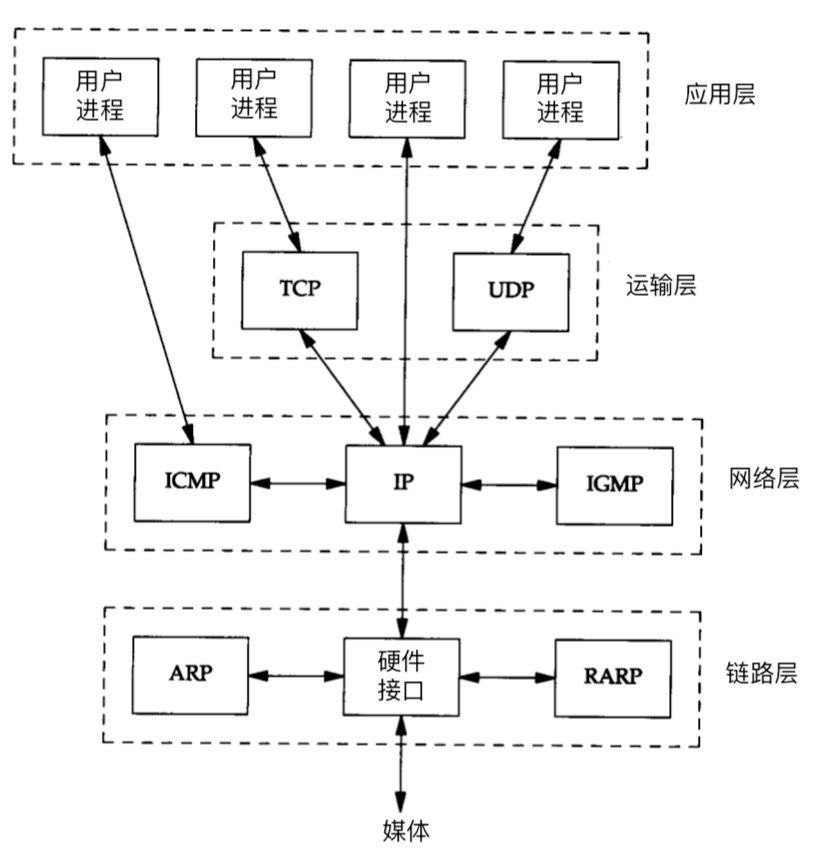
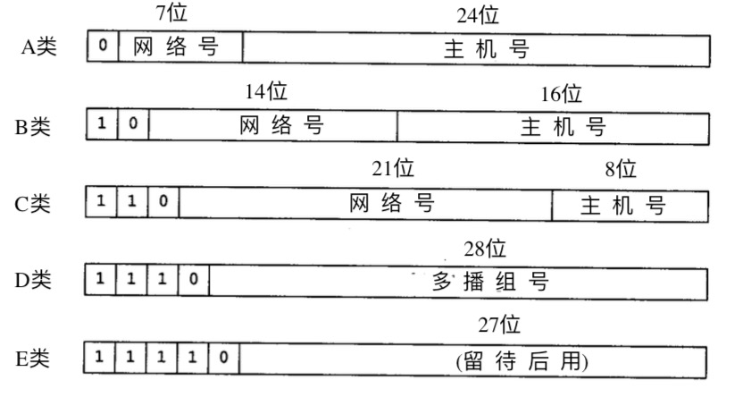
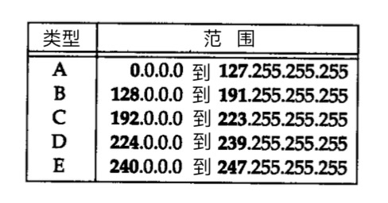
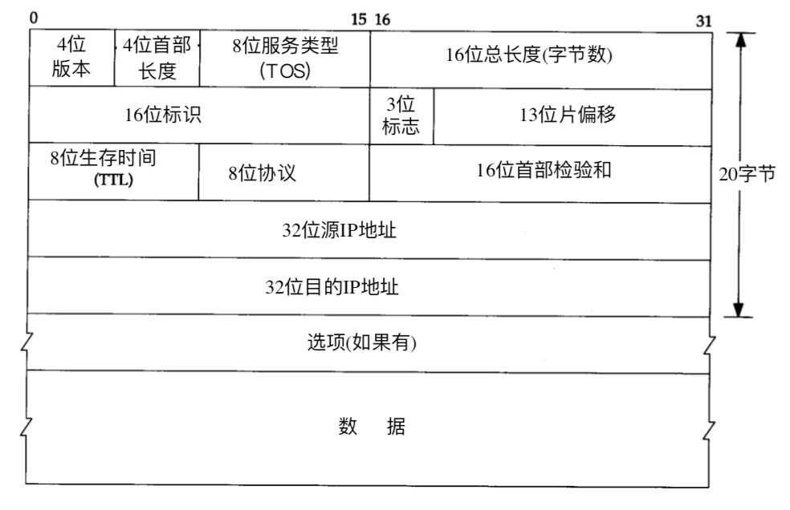
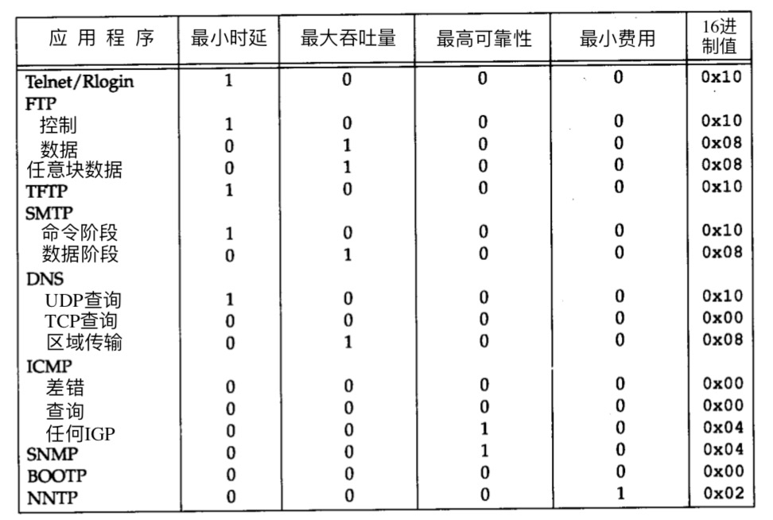

## TCP IP 卷1

### 一、概述

#### 分层

* **链路层** 设备驱动程序及接口卡
* **网络层** IP，ICMP，IGMP
* **运输层** TCP, UDP
* **应用层** Telent, FTP, e-mail

#### TCP/IP的分层

#### 互联网地址

#### 封装与分用

#### 客户-服务器模型

服务分为两种类型，重复型和并发型

重复型交互

1. 等待一个客户请求的到来。 
2. 处理客户请求。（无法处理其他用户的请求）
3. 发送响应给发送请求的客户。 
4. 返回 1 步。 

并发型交互

1. 等待一个客户请求的到来。 
2.  启动一个新的服务器来处理这个客户的请求。在这期间可能生成一个新的进程、任务 或线程，并依赖底层操作系统的支持。这个步骤如何进行取决于操作系统。生成的新服务器 对客户的全部请求进行处理。处理结束后，终止这个新服务器。 
3. 返回 1 步。 

一般来说，TCP服务器是并发的，而UDP服务器是重复的

#### 端口号

## 二、链路层 TODO

> 链路层的三个目的
>
> * 为IP模块发送和接受IP数据报
> * 为ARP模块发送和接受ARP应答
> * 为RARP模块发送和接受RARP应答

## 三、IP

#### IP首部

4个字节的32bit值从0-31按照一个字节的次序传输，这种传输次序称为**big endian字节序**，TCP/IP首部中所有的二级制整数在网络中传输时都要求以这种次序，因此也称之为**网络字节序**

* **版本**： 目前是4或者6

* **首部长度**：指首部占32bit字的数目，包括选项。有4位，所以最大可表示 15 * 4（32bit）= 60 字节 首部长度。普通IP数据报（没有选项）是5

* **服务类型（TOS）**：包括一个3bit的优先权子字段（现在已被忽略），4bit的TOS子字段，和1bit未用位但是必须置0 。4bit的TOS分别代表：**最小时延，最大吞吐量，最高可靠性，最小费用** 均为0则代表一般服务。大多数实现不允许服务器设置TOS字段

  

* **总长度**：整个IP数据报的长度，单位是字节。利用首部长度和总长度字段就可以知道数据报中内容的起始位置和长度。该字段有16bit，故IP数据报最长可达65535字节。

  尽管可以传送一个长达65535字节的数据报，但是大多数链路层会对其分片。而且主机也不能接受超过576字节的数据报，UDP（RIP, TFTP, BOOTP, DNS, SNMP等）一般限制在512字节。但是实际上大多数的实现允许超过8192字节的ip数据报

* **标识**： 唯一地标识主机发送的每一份数据报，通常发送一份就会加1

* **标志**

* **片偏移**

* **生存时间TTL**: 设置了数据报可以经过的最多路由器数，一旦经过一个处理它的路由器，值就减1，为0时则该数据报被丢弃，并发送ICMP报文通知源主机。

* **协议**：根据它可以识别哪个协议向ip传送的数据

  1 ICMP

  2 IGMP

  6 TCP

  17 UDP

* **首部校验和**：根据ip首部计算出的校验合码。计算校验和首先把校验和字段设置成0，然后对首部中每个16bit进行二进制反码求和（整个首部看成是由一串16bit的字组成）结果存在校验和字段中，当收到一份ip数据报时，同时对首部中的每个16bit进行二进制反码求和，和校验和比对，接收方计算出应全为1，不是1则丢弃。

* **任选项**：数据报中一个可变长的可选信息

  * 安全和处理限制（军事领域）
  * 记录路径（让每个路由器都记录下它的IP地址）
  * 时间戳（让每个路由器都记下它的IP地址和时间）
  * 宽松的源站选路（为数据报指定一系列必须经过的IP地址）
  * 严格的源站选路（与宽松的源站选路类似，但是要求只能经过这些指定的地址，不能经过其他地址）

  这些选项以32bit作为界限，必要的时候插入0为填充字节

#### IP路由选择

